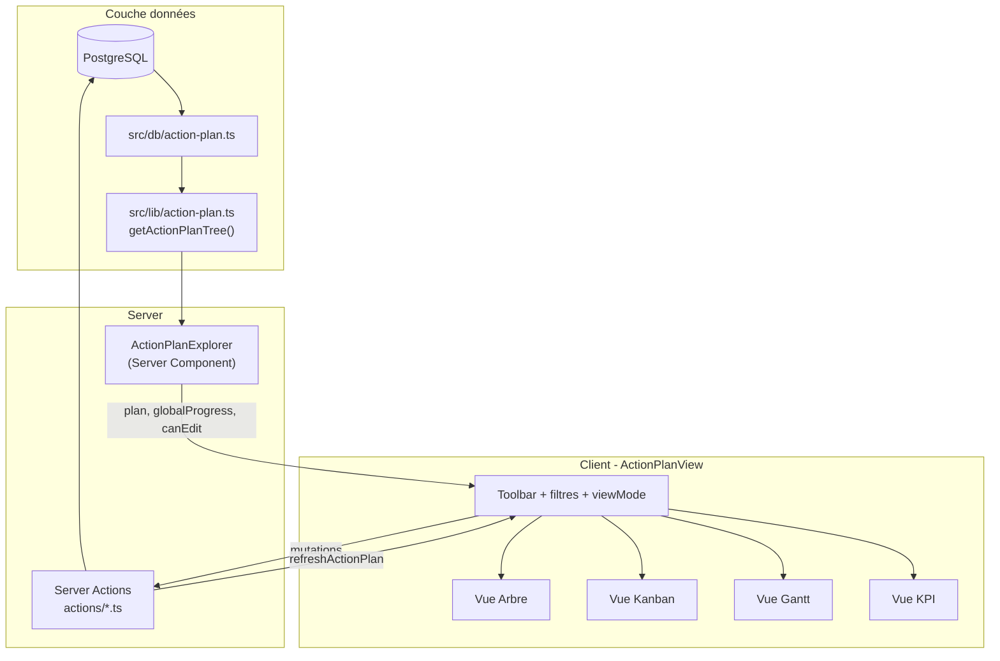

# Guide de réplication — Plan d'action multi-vues (Arbre / Kanban / Gantt / KPI)

Document de référence pour porter la feature **Plan d'action** depuis Jaeger vers un **autre projet Next.js App Router**.

**Référence source :** `src/plugins/features/action-plan-explorer/` dans le dépôt Jaeger.

---

## Table des matières

1. [Vue d'ensemble](#1-vue-densemble)
2. [Prérequis projet cible](#2-prérequis-projet-cible)
3. [Phase 1 — Schéma Drizzle et couche données](#3-phase-1--schéma-drizzle-et-couche-données)
4. [Phase 2 — Vue Arbre et Server Component](#4-phase-2--vue-arbre-et-server-component)
5. [Phase 3 — Orchestrateur ActionPlanView](#5-phase-3--orchestrateur-actionplanview)
6. [Phase 4 — Vues Kanban et Gantt](#6-phase-4--vues-kanban-et-gantt)
7. [Phase 5 — Vue KPI, import/export et permissions](#7-phase-5--vue-kpi-importexport-et-permissions)
8. [Checklist de validation](#8-checklist-de-validation)
9. [Pièges connus](#9-pièges-connus)
10. [Inventaire des fichiers source Jaeger](#10-inventaire-des-fichiers-source-jaeger)

---

## 1. Vue d'ensemble

La feature repose sur un **modèle hiérarchique à 5 niveaux** alimenté par PostgreSQL (Drizzle), transformé en arbre applicatif (`ActionPlanTree`), puis projeté dans 4 vues par un **orchestrateur client unique** (`ActionPlanView`).



**Hiérarchie métier :**

```
Axe → Sous-axe → SMART → Action → Sous-action
```

**Choix d'architecture clés (à reproduire) :**

| Choix | Détail |
|-------|--------|
| Gantt / Kanban | Rendu **100 % custom** (Tailwind + HTML5 drag & drop), pas de lib externe |
| API | **Server Actions** Next.js uniquement, pas de REST |
| État | `useState` / `useMemo` / `useCallback` dans `ActionPlanView`, pas de store global |
| Source de vérité | `getActionPlanTree()` côté serveur, rafraîchi via `refreshActionPlan()` |

---

## 2. Prérequis projet cible

| Dépendance | Usage |
|------------|-------|
| Next.js 14+ App Router | Pages, Server Components, Server Actions |
| PostgreSQL + Drizzle ORM | Schéma + requêtes relationnelles |
| Tailwind CSS | Tous les styles (pas de CSS dédié) |
| shadcn/ui | Button, Select, Badge, AlertDialog, Card, Chart, Input, ScrollArea |
| lucide-react | Icônes toolbar (List, LayoutGrid, Calendar, BarChart3) |
| sonner | Toasts d'erreur/succès |
| recharts | Vue KPI uniquement |

```bash
npm install drizzle-orm postgres sonner recharts
npx shadcn@latest add button select badge alert-dialog card chart input scroll-area
```

Adapter `@/lib/db`, `@/lib/utils` et votre couche auth (`getUserPermissions` ou équivalent).

---

## 3. Phase 1 — Schéma Drizzle et couche données

### 3.1 Schéma PostgreSQL

Copier `src/db/action-plan.ts` depuis Jaeger.

**Enums :**

- `pole` : si, commercial, communication, qualite, marketing, rh, tresorerie, presidence, autre
- `task_status` : not_started, in_progress, done, blocked
- `campus` : paris, lyon, marseille

**Tables (cascade on delete) :**

```
action_plan_axes
  └── action_plan_sub_axes (axis_id)
        └── action_plan_smarts (sub_axis_id)
              └── action_plan_actions (smart_id)
                    └── action_plan_sub_actions (action_id)

action_plan_action_poles (action_id + pole) — PK composite
action_plan_sub_action_poles (sub_action_id + pole) — PK composite
action_plan_comments (optionnel)
```

**Champs métier sur actions/sous-actions :** title, description, owner, status, progress (0–100), priority, order, startDate, dueDate, campus.

**Relations Drizzle obligatoires** pour les requêtes `with` imbriquées :

```typescript
export const actionPlanAxesRelations = relations(actionPlanAxesTable, ({ many }) => ({
  subAxes: many(actionPlanSubAxesTable),
}));
// … enchaîner subAxes → smarts → actions → subActions
```

Générer et appliquer la migration :

```bash
npx drizzle-kit generate
npx drizzle-kit migrate
```

Réexporter les tables dans `src/db/schema.ts`.

### 3.2 `getActionPlanTree()`

Créer `src/lib/action-plan.ts`.

**Type exporté :**

```typescript
export type ActionPlanTree = AxisNode[];

type AxisNode = {
  axis: ActionPlanAxis;
  progress: number;
  subAxes: SubAxisNode[];
};
// SubAxisNode → smarts → actions → subActions
// actions/subActions portent poles: string[]
```

**Algorithme de progression (moyenne récursive) :**

| Niveau | Règle |
|--------|-------|
| Sous-action | `subAction.progress` |
| Action | Moyenne des sous-actions si présentes, sinon `action.progress` |
| SMART | Moyenne des actions |
| Sous-axe | Moyenne des SMART |
| Axe | Moyenne des sous-axes |
| Global | Moyenne des axes |

**Requête Drizzle :** `findMany` avec `with` sur 5 niveaux + deux requêtes séparées pour les tables de jonction pôles :

```typescript
const [actionPoles, subActionPoles] = await Promise.all([
  db.select({ actionId, pole }).from(actionPlanActionPolesTable),
  db.select({ subActionId, pole }).from(actionPlanSubActionPolesTable),
]);
```

Construire des maps `actionPoleMap` / `subActionPoleMap` puis assembler l'arbre en mémoire.

### 3.3 Server Actions CRUD de base

Créer `src/features/action-plan-explorer/action-plan-explorer/actions/` avec un fichier par niveau hiérarchique.

**Pattern obligatoire :**

```typescript
"use server";

import { eq } from "drizzle-orm";
import { revalidatePath } from "next/cache";
import { requireActionPlanPermissions } from "./permissions";

export async function createAxis(data: { title: string; description?: string; order?: number }) {
  try {
    await requireActionPlanPermissions();
    await db.insert(actionPlanAxesTable).values({ /* … */ });
    revalidatePath("/action-plan"); // adapter le chemin de votre page
    return { success: true };
  } catch (error) {
    if (error instanceof Error && error.message.includes("Accès refusé")) {
      return { success: false, error: error.message };
    }
    return { success: false, error: "Erreur lors de la création" };
  }
}
```

**Fichiers à porter :**

| Fichier | Opérations |
|---------|------------|
| `axis.ts` | createAxis, updateAxis, deleteAxis |
| `sub-axis.ts` | CRUD sous-axes |
| `smart.ts` | CRUD objectifs SMART |
| `action.ts` | CRUD actions + gestion pôles (table de jonction) |
| `sub-action.ts` | CRUD sous-actions + pôles |
| `permissions.ts` | `requireActionPlanPermissions()` |
| `index.ts` | Barrel export |

Exemple création action avec pôles (Jaeger) :

```typescript
const [action] = await db.insert(actionPlanActionsTable).values({ /* … */ }).returning();

if (action && data.poles?.length) {
  await db.insert(actionPlanActionPolesTable).values(
    data.poles.map((pole) => ({ actionId: action.id, pole })),
  );
}
```

---

## 4. Phase 2 — Vue Arbre et Server Component

### 4.1 Structure de fichiers

```
src/features/action-plan-explorer/
├── action-plan-explorer-feature.tsx
├── index.ts
└── action-plan-explorer/
    ├── tree/
    │   ├── index.tsx
    │   └── action-plan-tree-explorer.tsx
    ├── detail-editor/
    │   └── index.tsx
    └── dialogs/
        ├── axis-dialog.tsx
        ├── sub-axis-dialog.tsx
        ├── smart-dialog.tsx
        ├── action-dialog.tsx
        ├── sub-action-dialog.tsx
        ├── constants.ts          # POLES, labels campus
        └── index.ts
```

### 4.2 Server Component d'entrée

`action-plan-explorer-feature.tsx` :

```typescript
import { getActionPlanTree } from "@/lib/action-plan";
import { getUserPermissions } from "@/lib/permissions";
import { ActionPlanView } from "./action-plan-explorer";

export async function ActionPlanExplorer() {
  const permissions = await getUserPermissions();
  const actionPlan = await getActionPlanTree();

  const canEdit =
    permissions.isDSI ||
    permissions.isPresident ||
    permissions.isVicePresident ||
    permissions.isAdmin ||
    permissions.isResponsableQualite;

  return (
    <ActionPlanView
      plan={actionPlan.tree}
      globalProgress={actionPlan.globalProgress}
      canEdit={canEdit}
    />
  );
}
```

Page Next.js :

```typescript
// src/app/(authenticated)/action-plan/page.tsx
import { ActionPlanExplorer } from "@/features/action-plan-explorer";

export default function ActionPlanPage() {
  return <ActionPlanExplorer />;
}
```

### 4.3 Vue Arbre

Fichier source : `tree/action-plan-tree-explorer.tsx`

| Fonctionnalité | Implémentation |
|----------------|----------------|
| Layout | Sidebar 380px repliable + panneau détail |
| Persistance sidebar | `localStorage` (clé configurable, ex. `app.action-plan.treeSidebarExpanded`) |
| Nœuds | 5 types : axis, subAxis, smart, action, subAction |
| Recherche | Filtre texte sur titres/descriptions à tous les niveaux |
| Édition | `ActionPlanDetailEditor` dans le panneau droit |
| CRUD | Dialogues modales + boutons ajouter/supprimer |

**Props clés de `TreeExplorerView` :**

```typescript
type TreeExplorerViewProps = {
  plan: ActionPlanTree;
  expandedAxes: Set<string>;
  expandedSubAxes: Set<string>;
  expandedSmarts: Set<string>;
  expandedActions: Set<string>;
  toggleAxis / toggleSubAxis / toggleSmart / toggleAction: (id: string) => void;
  selectedNode: { id: string; type: TreeNodeType } | null;
  onSelectNode: (node) => void;
  detailContent: React.ReactNode;
};
```

Toolbar spécifique mode arbre : boutons « Dérouler/Replier », « Ajouter un axe », import/export JSON.

---

## 5. Phase 3 — Orchestrateur ActionPlanView

Fichier central : `action-plan-explorer/action-plan-view.tsx` (~1550 lignes).

### 5.1 État client

| État | Rôle |
|------|------|
| `plan`, `globalProgress` | Copie locale, rafraîchie via `refreshActionPlan()` |
| `viewMode` | `"tree" \| "kanban" \| "gantt" \| "kpi"` (défaut : `"tree"`) |
| `campusFilter`, `poleFilter` | Filtres transverses |
| `axisFilter`, `subAxisFilter`, `smartFilter` | Filtres hiérarchiques (masqués en mode tree) |
| `expandedAxes/SubAxes/Smarts/Actions` | Expansion arbre |
| `selectedTreeNode` | Nœud sélectionné |
| `kanbanDragOverStatus`, `kanbanUpdatingId` | UX drag & drop Kanban |

### 5.2 Bascule de vues

Toolbar avec 4 boutons → `setViewMode(...)`.

```typescript
const [viewMode, setViewMode] = useState<"tree" | "kanban" | "gantt" | "kpi">("tree");

{viewMode === "tree" && <ActionPlanTreeView ... />}
{viewMode === "kanban" && <ActionPlanKanbanView ... />}
{viewMode === "gantt" && <ActionPlanGanttView ... />}
{viewMode === "kpi" && <ActionPlanKpiView ... />}
```

**Règles UX :**

- Passage en `tree` → reset filtres axe/sous-axe/SMART
- Import/export visible uniquement en mode `tree`
- Filtre pôle surtout utile pour Kanban

### 5.3 Filtres et données dérivées

**Filtre campus** (`filteredPlan`) : conserve une action si elle a le campus OU si une sous-action l'a ; filtre les sous-actions par campus.

**Filtres hiérarchiques** (`filteredPlanForViews`) : axe → sous-axe → SMART en cascade.

```typescript
const filteredPlanForViews = useMemo(() => {
  let result = filteredPlan;
  if (axisFilter !== "all") {
    result = result.filter((axis) => axis.axis.id === axisFilter);
  }
  if (subAxisFilter !== "all") {
    result = result.map((axis) => ({
      ...axis,
      subAxes: axis.subAxes.filter((sa) => sa.subAxis.id === subAxisFilter),
    }));
  }
  if (smartFilter !== "all") {
    result = result.map((axis) => ({
      ...axis,
      subAxes: axis.subAxes.map((sa) => ({
        ...sa,
        smarts: sa.smarts.filter((s) => s.smart.id === smartFilter),
      })),
    }));
  }
  return result;
}, [filteredPlan, axisFilter, subAxisFilter, smartFilter]);
```

### 5.4 Abstractions partagées

| Fichier | Contenu |
|---------|---------|
| `action-plan-view.styles.ts` | Type `KanbanStatus`, classes Tailwind light/dark |
| `action-plan-view-shared.tsx` | `ProgressBar`, `PolesBadges`, `CampusBadge`, `getStatusColor/Label/Hover` |

Type `KanbanStatus` :

```typescript
export type KanbanStatus = "not_started" | "in_progress" | "done" | "blocked";
```

---

## 6. Phase 4 — Vues Kanban et Gantt

### 6.1 Vue Kanban

Fichier : `kanban/index.tsx`

**Règle métier clé :** si une action a des sous-actions → seules les **sous-actions** apparaissent en cartes ; sinon l'**action** elle-même.

**Construction des colonnes** (`kanbanColumns` dans `action-plan-view.tsx`) :

```typescript
const kanbanColumns = useMemo(() => {
  const columns: Record<KanbanStatus, KanbanCard[]> = {
    not_started: [], in_progress: [], done: [], blocked: [],
  };

  for (const axis of filteredPlanForViews) {
    for (const subAxis of axis.subAxes) {
      for (const smart of subAxis.smarts) {
        for (const action of smart.actions) {
          if (action.subActions.length === 0) {
            if (poleFilter !== "all" && !action.poles.includes(poleFilter)) continue;
            columns[action.action.status ?? "not_started"].push({ kind: "action", /* … */ });
          } else {
            for (const subAction of action.subActions) {
              if (poleFilter !== "all" && !subAction.poles.includes(poleFilter)) continue;
              columns[subAction.subAction.status ?? "not_started"].push({ kind: "subAction", /* … */ });
            }
          }
        }
      }
    }
  }
  return columns;
}, [filteredPlanForViews, poleFilter]);
```

**Drag & drop HTML5 :**

```typescript
// onDragStart sur la carte
e.dataTransfer.setData("application/json", JSON.stringify({
  kind: card.kind,
  id: card.id,
  currentStatus: card.status,
}));

// onDrop sur la colonne
const payload = JSON.parse(e.dataTransfer.getData("application/json"));
if (payload.currentStatus !== newStatus) {
  onStatusDrop({ kind: payload.kind, id: payload.id }, newStatus);
}
```

**Handler de mutation :**

```typescript
const handleKanbanStatusDrop = useCallback(async (payload, newStatus) => {
  if (!canEdit) return;
  setKanbanUpdatingId(payload.id);
  try {
    const res = payload.kind === "action"
      ? await updateAction(payload.id, { status: newStatus })
      : await updateSubAction(payload.id, { status: newStatus });
    if (!res.success) throw new Error(res.error);
    await refreshData();
  } finally {
    setKanbanUpdatingId(null);
  }
}, [canEdit, refreshData]);
```

4 colonnes : Non démarré / En cours / Terminé / Abandonné.

### 6.2 Vue Gantt

Fichier : `gantt/index.tsx`

**Données** (`ganttRows`) : actions/sous-actions ayant au moins `startDate` ou `dueDate`.

**Positionnement des barres :**

```typescript
const minMs = ganttDateRange.min.getTime();
const maxMs = ganttDateRange.max.getTime();
const rangeMs = maxMs - minMs || 1;

const startMs = row.startDate?.getTime() ?? row.dueDate!.getTime();
const endMs = row.dueDate?.getTime() ?? row.startDate!.getTime();

const leftPercent = ((startMs - minMs) / rangeMs) * 100;
const widthPercent = ((endMs - startMs) / rangeMs) * 100 || 2; // min 2%
```

**Échelle de dates :**

| Condition | Graduation |
|-----------|------------|
| Plage ≤ 45 jours | Ticks hebdomadaires |
| Plage > 45 jours | Ticks mensuels |
| Toujours | Bornes min/max + ligne « aujourd'hui » en % |

Clic sur ligne/barre → ouvre le dialogue d'édition (si `canEdit`).

---

## 7. Phase 5 — Vue KPI, import/export et permissions

### 7.1 Vue KPI

Fichier : `kpi/index.tsx`

- Aplatit l'arbre en `FlatItem[]` via `flattenPlan()`
- Graphiques Recharts via `@/components/ui/chart`
- Indicateurs : statut, campus, pôle, axe, priorité, échéances

Couleurs statut :

```typescript
const STATUS_COLORS: Record<KanbanStatus, string> = {
  not_started: "var(--chart-5)",
  in_progress: "var(--chart-1)",
  done: "var(--chart-2)",
  blocked: "var(--chart-4)",
};
```

### 7.2 Import / export JSON

Fichier : `actions/export-import.ts`

| Action | Description |
|--------|-------------|
| `exportActionPlan()` | Sérialise l'arbre complet en JSON (nécessite permissions) |
| `importActionPlan(json)` | Remplace ou fusionne selon la logique Jaeger |
| `refreshActionPlan()` | Rappelle `getActionPlanTree()` sans recharger la page |

```typescript
export async function refreshActionPlan() {
  const result = await getActionPlanTree();
  return { success: true, tree: result.tree, globalProgress: result.globalProgress };
}
```

Côté client :

```typescript
const refreshData = useCallback(async () => {
  setIsRefreshing(true);
  const res = await refreshActionPlan();
  if (res.success && res.tree) {
    setPlan(res.tree);
    setGlobalProgress(res.globalProgress ?? 0);
    setLastUpdate(new Date());
  } else {
    toast.error(res.error ?? "Erreur lors du rafraîchissement");
  }
  setIsRefreshing(false);
}, []);
```

### 7.3 Permissions

`actions/permissions.ts` :

```typescript
export async function requireActionPlanPermissions() {
  const permissions = await getUserPermissions();
  const canEdit =
    permissions.isDSI ||
    permissions.isPresident ||
    permissions.isVicePresident ||
    permissions.isAdmin ||
    permissions.isResponsableQualite;

  if (!canEdit) {
    throw new Error("Accès refusé : permissions insuffisantes pour modifier le plan d'action");
  }
  return permissions;
}
```

| Mode | Comportement |
|------|--------------|
| Lecture | Tous les utilisateurs authentifiés |
| Édition | Rôles autorisés uniquement — adapter à votre auth |
| `canEdit=false` | Pas de DnD Kanban, pas de boutons CRUD, pas d'éditeur inline |

Erreurs affichées via `toast.error()` (sonner), jamais `alert()`.

---

## 8. Checklist de validation

- [ ] Arbre : navigation 5 niveaux, recherche, sidebar repliable
- [ ] Arbre : CRUD axe → sous-action + gestion pôles
- [ ] Kanban : 4 colonnes, cartes filtrées par pôle
- [ ] Kanban : drag & drop change le statut en base
- [ ] Gantt : barres positionnées correctement avec dates
- [ ] Gantt : ligne « aujourd'hui » visible
- [ ] KPI : graphiques alimentés après filtrage
- [ ] Filtres campus/pôle/axe fonctionnent sur les 4 vues
- [ ] `canEdit=false` : pas de DnD, pas de boutons mutation
- [ ] Toasts d'erreur sur échec Server Action
- [ ] Import/export JSON (mode tree, utilisateurs autorisés)
- [ ] `revalidatePath` pointe vers le bon chemin de page

---

## 9. Pièges connus

| Sujet | Recommandation |
|-------|----------------|
| Imports `@/` | Ajuster l'alias TypeScript vers votre structure |
| `@/lib/permissions` | Remplacer par votre guard auth (Clerk, Better Auth, etc.) |
| `revalidatePath` | Jaeger utilise `/pole/presidence` — adapter à `/action-plan` |
| Dates Gantt | Les timestamps Drizzle arrivent parfois en string côté client : parser avec `new Date(d)` |
| Relations Drizzle | Déclarer `relations()` pour que `db.query.*.findMany({ with })` fonctionne |
| Progression | Ne pas recalculer côté client sauf après `refreshActionPlan()` |
| Sidebar storage | Jaeger utilise `@/plugins/engine/explorer-sidebar-storage` — porter ou simplifier |
| Hydratation | `lastUpdate` initialisé dans `useEffect`, pas au render initial |

---

## 10. Inventaire des fichiers source Jaeger

Copier ces 30 fichiers, puis adapter imports et chemins `revalidatePath`.

### Base de données et lib

| Fichier | Rôle |
|---------|------|
| `src/db/action-plan.ts` | Schéma Drizzle complet |
| `src/lib/action-plan.ts` | `getActionPlanTree()` + type `ActionPlanTree` |

### Plugin / feature

| Fichier | Rôle |
|---------|------|
| `src/plugins/features/action-plan-explorer/plugin.json` | Métadonnées (optionnel hors Jaeger) |
| `src/plugins/features/action-plan-explorer/index.ts` | Exports publics |
| `src/plugins/features/action-plan-explorer/action-plan-explorer-feature.tsx` | Server Component |
| `src/plugins/features/action-plan-explorer/action-plan-explorer/index.ts` | Exports internes |
| `src/plugins/features/action-plan-explorer/action-plan-explorer/action-plan-view.tsx` | Orchestrateur |
| `src/plugins/features/action-plan-explorer/action-plan-explorer/action-plan-view.styles.ts` | Styles |
| `src/plugins/features/action-plan-explorer/action-plan-explorer/action-plan-view-shared.tsx` | Composants partagés |
| `src/plugins/features/action-plan-explorer/action-plan-explorer/tree/index.tsx` | Wrapper arbre |
| `src/plugins/features/action-plan-explorer/action-plan-explorer/tree/action-plan-tree-explorer.tsx` | Vue arbre |
| `src/plugins/features/action-plan-explorer/action-plan-explorer/kanban/index.tsx` | Vue Kanban |
| `src/plugins/features/action-plan-explorer/action-plan-explorer/gantt/index.tsx` | Vue Gantt |
| `src/plugins/features/action-plan-explorer/action-plan-explorer/kpi/index.tsx` | Vue KPI |
| `src/plugins/features/action-plan-explorer/action-plan-explorer/detail-editor/index.tsx` | Éditeur inline |
| `src/plugins/features/action-plan-explorer/action-plan-explorer/dialogs/*.tsx` | 5 dialogues CRUD |
| `src/plugins/features/action-plan-explorer/action-plan-explorer/actions/*.ts` | 8 Server Actions |

### Ordre de portage recommandé

1. `src/db/action-plan.ts` + migration
2. `src/lib/action-plan.ts`
3. `actions/` (permissions + CRUD + export-import)
4. `dialogs/` + `detail-editor/`
5. `tree/`
6. `action-plan-view.styles.ts` + `action-plan-view-shared.tsx`
7. `action-plan-view.tsx` (orchestrateur)
8. `kanban/` + `gantt/` + `kpi/`
9. `action-plan-explorer-feature.tsx` + page Next.js

**Estimation effort :** ~30 fichiers, complexité concentrée dans `action-plan-view.tsx`. Copier d'abord tel quel, puis adapter auth et chemins.

---

*Généré à partir de l'implémentation Jaeger — juin 2026.*
