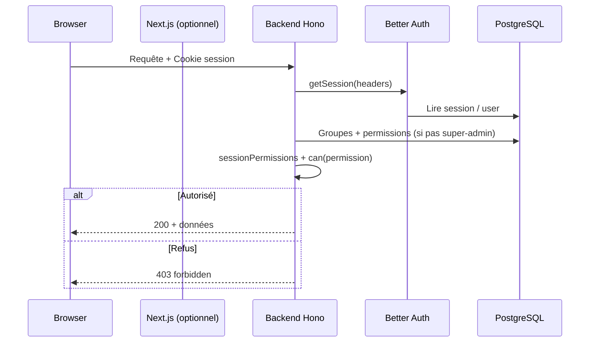

# Gestion des accès (JaegerMyster)

Ce document décrit **comment l’authentification et l’autorisation fonctionnent** dans ce dépôt, afin de pouvoir **reproduire le même modèle** sur une autre plateforme (y compris en architecture microservices).

---

## 1. Principes généraux

### 1.1 Séparation des responsabilités

| Couche | Rôle |
|--------|------|
| **Authentification** | Prouver l’identité de l’utilisateur (session Better Auth, cookies HTTP-only). |
| **Autorisation (UBAC)** | Décider ce que l’utilisateur **peut faire** à partir d’un **catalogue de permissions** et de son **appartenance aux groupes Google Workspace** synchronisés en base. |

Il n’y a **pas** de rôles applicatifs nommés du type `admin` / `editor` dans la base utilisateur pour le métier : les droits viennent des **permissions attachées aux groupes** (+ un mécanisme **super-admin** par liste d’IDs utilisateur).

### 1.2 Modèle : UBAC (User / Group–Based Access Control)

- **Unité d’attribution** : groupe Google Workspace (`gw.workspace_group`), synchronisé depuis l’annuaire.
- **Lien utilisateur → groupes** : table `gw.workspace_group_member` (membres directs utilisateur ou sous-groupes imbriqués).
- **Lien groupe → permissions** : table `gw.workspace_group_permission` (plusieurs lignes par groupe, une permission par ligne).
- **Droits effectifs** pour une requête : **union** des permissions de **tous** les groupes dont l’utilisateur est membre (après expansion des sous-groupes), filtrées par le **catalogue** serveur.

### 1.3 Super-administrateurs

Les utilisateurs dont l’ID est listé dans la variable d’environnement **`ADMIN_USER_IDS`** (liste séparée par des virgules) reçoivent **toutes** les permissions du catalogue, sans lecture des permissions groupe.

> **Réplication** : équivalent à un groupe technique `platform-admins` ou à des claims OIDC `permissions: ["*"]` — à vous de choisir, mais le **comportement** est : bypass des permissions groupe + accès aux routes d’administration.

---

## 2. Catalogue des permissions

Le catalogue est **unique et codé en dur** côté backend (`backend/src/ubac.ts`) : tableau `PERMISSIONS` + type TypeScript `Permission`.

Caractéristiques :

- Les chaînes stockées en base qui **ne figurent pas** dans le catalogue sont **ignorées** (`normalizeStoredPermissions`).
- Toute API d’administration qui enregistre des permissions doit **valider** contre ce catalogue (`validatePermissionList`).

Exemples de familles : `app.*`, `crm.*`, `agenda.*`, `erp.*`, `rh.*`, etc. Chaque route métier décide quelle(s) permission(s) exiger (souvent `*.read` / `*.write` / `*.delete`, plus des droits fins comme `crm.sprint.manage` ou `agenda.{pole}.manage`).

Voir aussi [agenda-evenements.md](./agenda-evenements.md) pour le module Agenda (`agenda.read`, `agenda.{pole}.write`, `agenda.{pole}.manage`).

> **Microservices** : publiez ce catalogue comme **package partagé** ou **contrat OpenAPI / schéma JSON** versionné, pour que tous les services utilisent **exactement** les mêmes identifiants de permission.

---

## 3. Authentification (Better Auth)

### 3.1 Backend

- Fichier : `backend/src/auth.ts`.
- **Better Auth** avec adaptateur **Drizzle** / PostgreSQL.
- Connexion **email + mot de passe** et optionnellement **Google OAuth** (scopes annuaire pour sync des groupes + Drive en lecture selon config).

Les cookies de session sont configurés avec **httpOnly**, **sameSite: lax**, **secure** selon `BETTER_AUTH_URL` / override `AUTH_COOKIE_SECURE`.

### 3.2 Point d’entrée HTTP

Les routes `GET`/`POST` sous `/api/auth/*` sont déléguées au handler Better Auth (`backend/src/app.ts`).

### 3.3 Frontend (Next.js)

- Client : `web/lib/auth-client.ts` (`createAuthClient` de `better-auth/react`, `credentials: "include"`).
- **Rewrite** Next.js : `/api/auth/:path*` → backend (`web/next.config.ts`), pour que le navigateur parle au **même origine** que l’app Next (cookies first-party).

### 3.4 Garde « utilisateur connecté »

- Composant client `web/components/auth-guard.tsx` : `RedirectIfAnonymous` utilise `authClient.useSession()` ; si pas de session → redirection vers `/`.
- Le layout authentifié enveloppe l’app avec ce garde (`web/components/account/account-app-shell.tsx`).

> **Important** : cette garde ne vérifie **pas** les permissions UBAC ; elle évite seulement d’afficher l’UI aux anonymes.

---

## 4. Calcul des permissions par requête (backend)

### 4.1 Middleware de session

Fichier : `backend/src/middleware/session.ts`, appliqué à **toutes** les routes sauf `/health` (`backend/src/app.ts`).

Enchaînement :

1. `auth.api.getSession({ headers: c.req.raw.headers })` — lecture session depuis les cookies.
2. Si pas de session : `user`, `session`, `sessionPermissions` → `null`.
3. Si session :
   - Si **super-admin** (`isSuperAdminUserId`) : `sessionPermissions` = **toutes** les permissions du catalogue.
   - Sinon :
     - Résolution des **IDs de groupes** pour l’email de l’utilisateur : `getWorkspaceGroupIdsForUserEmail` (`backend/src/lib/gw-group-membership.ts`).
     - Requête SQL : toutes les lignes `workspace_group_permission` dont `workspace_group_id` est dans cet ensemble.
     - Normalisation + `permissionsForUser` (qui, hors super-admin, renvoie la liste groupe).

Les variables Hono typées sont décrites dans `backend/src/types/app.ts` (`AppVariables`).

### 4.2 Expansion des sous-groupes Google

Fichier : `backend/src/lib/gw-group-membership.ts`.

- Membres **utilisateur** : lignes `member_kind = 'user'` avec email comparé en **lower case**.
- Arêtes **sous-groupe** : `member_kind = 'group'` (`container_group_id` contient `member_nested_group_id`).
- Algorithme : à partir des groupes où l’utilisateur est membre direct, on **remonte** les conteneurs tant qu’un sous-groupe connu est inclus dans un parent (boucle fixpoint).

> **Réplication** : en microservice « annuaire », vous pouvez soit **pré-calculer** la fermeture transitive en base (table matérialisée), soit garder cette expansion **à la volée** comme ici (acceptable si le graphe reste modeste).

---

## 5. Vérification d’autorisation côté API

### 5.1 Helper `can(context, permission)`

Fichier : `backend/src/lib/ubac-http.ts`.

```text
can(c, "crm.read") ⇔ sessionPermissions contient "crm.read"
```

Chaque route métier appelle explicitement `can` et renvoie **403** avec un corps du type `{ error: "forbidden", need: "crm.read" }` si refus.

> **Règle d’or** : le **client** (Next, mobile, autre) ne fait que de l’UX ; **toute** mutation ou donnée sensible doit être protégée ainsi sur le **service qui détient la donnée**.

### 5.2 Routes « authorize » (sondage serveur)

Fichier : `backend/src/routes/core/authorize.ts`, monté sur `/api/app/authorize`.

- **GET** `?permission=crm.read` : JSON `{ ok: true }` ou erreurs `401` / `403` / `400`.
- **POST** JSON :
  - `mode`: `"any"` (défaut) ou `"all"`.
  - `permissions`: tableau (max 64 entrées), chaque entrée doit être dans le catalogue.
  - Logique : `any` → au moins une permission satisfaite ; `all` → toutes requises.

Un **rate limit** en mémoire par utilisateur ou par IP limite l’abus (`backend/src/middleware/authorize-rate-limit.ts`).

### 5.3 Route « session » publique (hors jeton)

Fichier : `backend/src/routes/core/session.ts`, **GET `/session`**.

Réponse JSON (utilisateur connecté) :

- `user` : objet utilisateur Better Auth (tel que fourni par la session).
- `permissions` : liste **effective** des permissions (pour affichage UI / `hasPermission`).
- `isSuperAdmin` : booléen.
- `session` : **sous-ensemble** non sensible (`id`, `expiresAt` seulement) — pas de jeton brut.

---

## 6. Frontend : comment les permissions sont consommées

### 6.1 Proxy Next → backend

`web/next.config.ts` réécrit :

- `/session` → backend `/session`
- `/api/app/:path*` → backend `/api/app/:path*`

Le navigateur appelle donc **le même origin** que Next ; les **cookies** de session sont transmis.

### 6.2 Contexte client UBAC

Fichiers : `web/lib/ubac-session-context.tsx` (+ réexport `web/lib/ubac-client.ts`).

- Au montage, **une** requête `GET /session` (avec déduplication / cache court pour Strict Mode).
- Expose `hasPermission(p)`, `isSuperAdmin`, `refetch()`, etc.
- `AccountAppShell` enveloppe l’arbre avec `UbacSessionProvider`.

### 6.3 Garde Server Components (pages sensibles)

Fichier : `web/lib/server-authorize.ts` — fonction `assertBackendAccess`.

- `POST` vers **`${AUTH_BACKEND_URL}/api/app/authorize`** (ou défaut local) avec **les cookies** de la requête Next (`headers().get("cookie")`).
- `401` → redirection `redirectUnauthorized` (souvent `/`).
- Autre non-OK → redirection `redirectForbidden` (souvent page settings).

Exemple : layout Myster (`web/app/(authentificated)/myster/layout.tsx`) exige **au moins une** des permissions listées dans `CRM_APP_ENTRY_PERMISSIONS` (dérivé de `CRM_NAV_ITEMS` dans `web/app/(authentificated)/myster/_components/crm-sections.ts`).

> **Intérêt** : empêcher d’envoyer au client le **bundle** des pages métier si l’utilisateur n’a aucune des permissions d’entrée (défense en profondeur en plus des API).

### 6.4 Navigation (sidebar)

Fichier : `web/components/account/account-nav-config.ts` : chaque entrée peut porter un champ `permission`. La sidebar utilise `useUbacSession().hasPermission` pour masquer ou désactiver les liens.

Arborescence actuelle (`ACCOUNT_NAV_SECTIONS`) :

| Section | Entrée | Route | Permission |
|---------|--------|-------|------------|
| Vue d'ensemble | Tableau de bord | `/account` | `app.overview` |
| Vue d'ensemble | Agenda | `/account/agenda` | `agenda.read` |
| Vue d'ensemble | Mon Google Drive | `/account/mon-google-drive` | `app.overview` |
| Commercial | Jaeger | `/jaeger` | `erp.read` |
| Commercial | Myster | `/myster/dashboard` | `crm.read` |
| Commercial | Marketing | `/marketing` | `marketing.read` |
| RH | App RH — Gestion RH (CDM) | `/rh/cdm` | `rh.read` |
| RH | Gestion Intervenant (RDI) | `/rh/intervenants` | `rh.read` |
| RH | Gestion Associative (SG) | `/rh/associatif` | `rh.read` |
| Pilotage | Trésorerie | `/tresorerie` | `tresorerie.read` |
| Pilotage | SI | `/si` | `si.read` |
| Pilotage | SI — panel tickets | `/si/manage` | `si.ticket.manage` |

Chaque route métier possède un `layout.tsx` avec `assertBackendAccess` aligné sur la permission d’entrée (défense SSR en plus du filtrage sidebar).

La section **Administration** (membres UBAC, Google Workspace) est affichée seulement si `isSuperAdmin` côté client — **l’API reste toutefois protégée** par `denyUnlessSuperAdmin` côté serveur.

> **Migration groupes** : les utilisateurs RDI ne doivent plus recevoir `si.read` pour accéder aux intervenants — utiliser `rh.read`. Réserver `si.read` à l’app SI (`/si`). Attribuer `marketing.read` pour l’app Marketing.

---

## 7. Administration (super-admin uniquement)

### 7.1 Helper `denyUnlessSuperAdmin`

Fichier : `backend/src/routes/admin/ubac-admin.ts` : si pas d’utilisateur → `401` ; si pas super-admin → `403`.

### 7.2 Routes UBAC lecture

- `GET /api/app/ubac/catalog` : liste des permissions du catalogue.
- `GET /api/app/ubac/users` : pour chaque utilisateur en base, groupes Workspace effectifs, permissions groupe, permissions effectives (avec la même logique super-admin).

### 7.3 Opérations Google Workspace

Fichier : `backend/src/routes/admin/gw-ops.ts` : sync annuaire, édition des permissions par groupe, etc. — derrière **`denyUnlessSuperAdmin`** (ou `denyUnlessAuthenticated` pour des endpoints « statut » plus permissifs selon le cas).

La synchronisation des groupes/membres est orchestrée depuis `backend/src/lib/gw-directory-sync.ts` (job async, etc.).

---

## 8. Synthèse du flux (une requête API métier)



---

## 9. Reproduire ce système en microservices

### 9.1 Ce qu’il faut conserver (contrat fonctionnel)

1. **Un catalogue de permissions** versionné, partagé entre services.
2. **Une source de vérité** pour :
   - groupes (identité stable),
   - membres (utilisateur ou groupe imbriqué),
   - permissions par groupe.
3. **Un calcul déterministe** « utilisateur → ensemble de permissions » (même règle d’union + expansion sous-groupes + super-admins).
4. **Vérification sur chaque service** qui expose des données (pas uniquement sur une « API gateway » si les autres services sont joignables autrement).

### 9.2 Découpage possible des services

| Service | Responsabilité |
|---------|----------------|
| **Auth** | Login, sessions, émission de jetons ou maintien de cookies (équivalent Better Auth). |
| **Directory / IAM** | Sync Google (ou autre IdP), tables groupes / membres / permissions, endpoints admin super-admin. |
| **Policy / PDP** (optionnel) | Endpoint `authorize` + `session`/`introspect` qui renvoie les permissions effectives pour un `sub` (sujet). |
| **Domaine métier** (CRM, RH, …) | Valide JWT/session auprès d’Auth **et** évalue `can` localement **ou** interroge le PDP. |

### 9.3 Propagation de l’identité entre services

Deux patterns courants (équivalents fonctionnels à l’état actuel « cookie + même calcul PDP ») :

**A. Jeton signé (OIDC / JWT)**  
Claims : `sub`, `email`, `permissions: string[]` **ou** `groups: string[]` si les services rechargent les permissions depuis **Directory** (moins de stale claims dans le jeton, plus de requêtes).

**B. Session opaque + introspection**  
Comme aujourd’hui : un service « session » lit la session et renvoie `{ permissions }` ; les autres services valident le cookie via une **introspection réseau** ou un **sidecar** partagé.

> **Sécurité** : ne faites **pas** confiance aux seuls claims `permissions` dans un JWT **sans** rotation courte ou sans signature forte + audience par service, si l’utilisateur peut manipuler un client intermédiaire. Le modèle actuel recalcule depuis la **base** à chaque requête middleware (hors cache implicite Postgres).

### 9.4 Équivalents des endpoints actuels

| Actuel | Rôle en microservices |
|--------|-------------------------|
| `GET /session` | **Introspection session** ou **UserInfo enrichi** avec permissions effectives. |
| `POST /api/app/authorize` | **PDP** (Policy Decision Point) pour les gates BFF / SSR. |
| `GET /api/app/ubac/*` | **Console IAM** ; peut rester sur le service Directory. |
| Middleware `session` + `can` | Librairie partagée **ou** middleware sidecar **ou** policy OPA/Rego alimentée par le même catalogue. |

### 9.5 BFF (Backend for Frontend)

Le pattern `assertBackendAccess` + rewrites Next correspond à un **BFF** : le SSR appelle le backend avec les cookies utilisateur. En microservices, le BFF peut :

- centraliser `authorize`,
- agréger les appels,
- ne jamais exposer les cookies du navigateur aux services internes (utiliser plutôt un jeton service-to-service + identité propagée).

### 9.6 Performance et opérations

- Aujourd’hui chaque requête authentifiée peut déclencher des **lectures SQL** (session + groupes + permissions). En charge, prévoir :
  - cache **courte TTL** des permissions par `userId` (invalidation à la sync annuaire ou au changement de droits),
  - ou matérialisation table `user_effective_permission`.
- Journalisation : middleware optionnel `HTTP_ACCESS_LOG` sur le backend (`session.ts`).

---

## 10. Fichiers de référence (index)

| Sujet | Fichier principal |
|-------|-------------------|
| Catalogue + super-admin | `backend/src/ubac.ts` |
| Session + calcul permissions | `backend/src/middleware/session.ts` |
| Expansion groupes | `backend/src/lib/gw-group-membership.ts` |
| `can()` | `backend/src/lib/ubac-http.ts` |
| Variables Hono | `backend/src/types/app.ts` |
| Routes authorize | `backend/src/routes/core/authorize.ts` |
| Route session | `backend/src/routes/core/session.ts` |
| Admin UBAC | `backend/src/routes/admin/ubac-admin.ts` |
| Schéma membre groupe | `backend/src/db/schema/gw/workspace-group-member.ts` |
| Schéma permission groupe | `backend/src/db/schema/gw/workspace-group-permission.ts` |
| Client session / `hasPermission` | `web/lib/ubac-session-context.tsx` |
| Garde SSR | `web/lib/server-authorize.ts` |
| Rewrites | `web/next.config.ts` |
| Auth Better Auth | `backend/src/auth.ts`, `web/lib/auth-client.ts` |

---

## 11. Limites et points d’attention

- **Confidentialité** : `GET /session` expose les permissions effectives au client — acceptable pour de l’UX, mais **ne remplace pas** les contrôles sur les routes métier.
- **Cohérence** : si la sync annuaire est en retard, les droits peuvent diverger de Google jusqu’au prochain job.
- **Rate limit authorize** : stockage en mémoire processus — en multi-instances, prévoir Redis ou équivalent pour un compteur global.
- **Comptes hors Google** : l’appartenance aux groupes Workspace repose sur l’**email** ; un utilisateur email/mot de passe avec un email hors annuaire n’aura **pas** de permissions groupe (sauf super-admin).

---

*Document généré à partir du code du dépôt JaegerMyster — à maintenir lors de l’évolution du catalogue ou des routes.*
