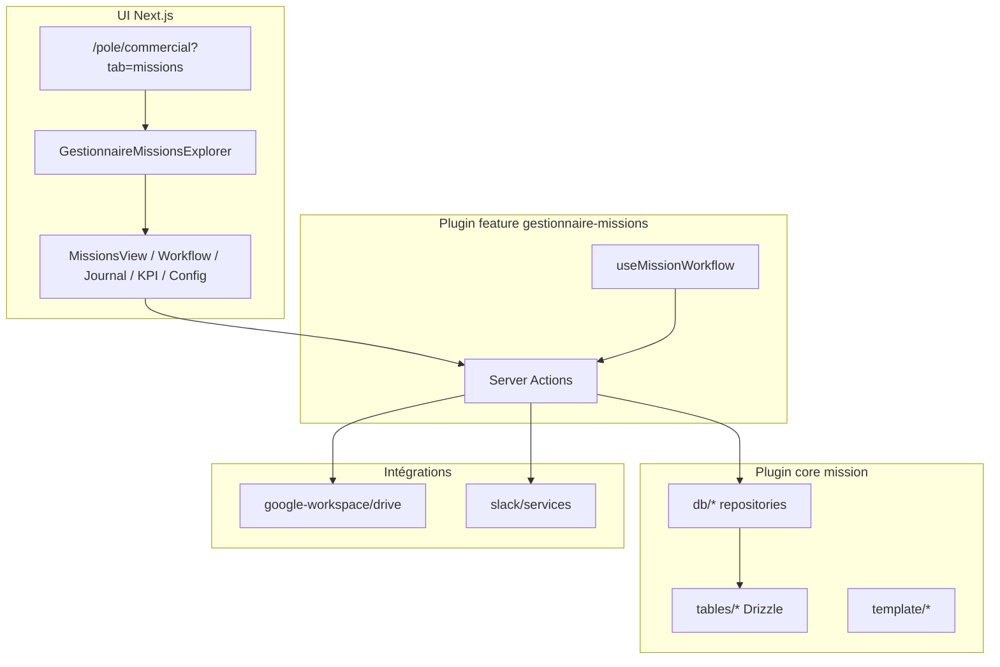
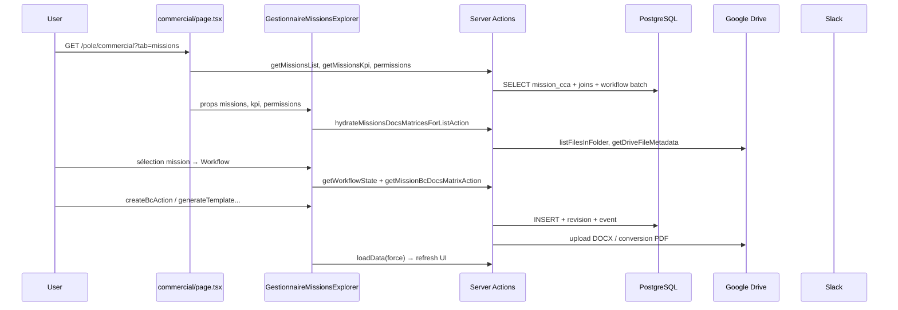
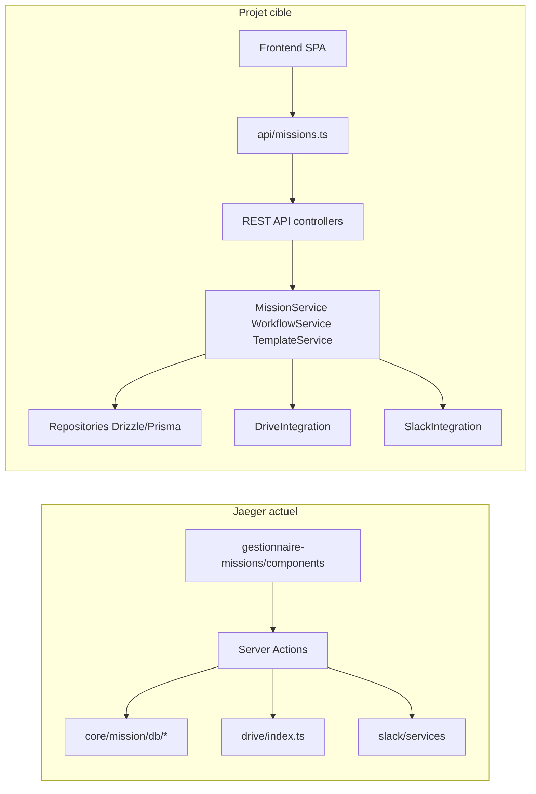
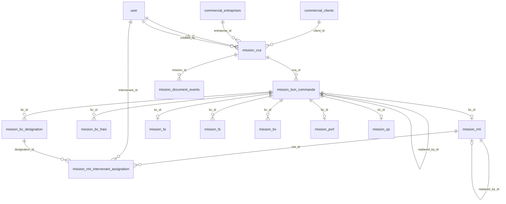
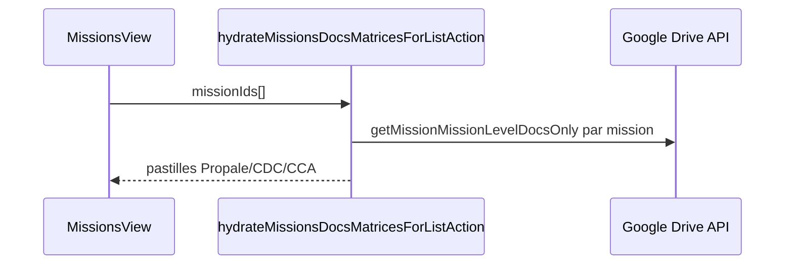
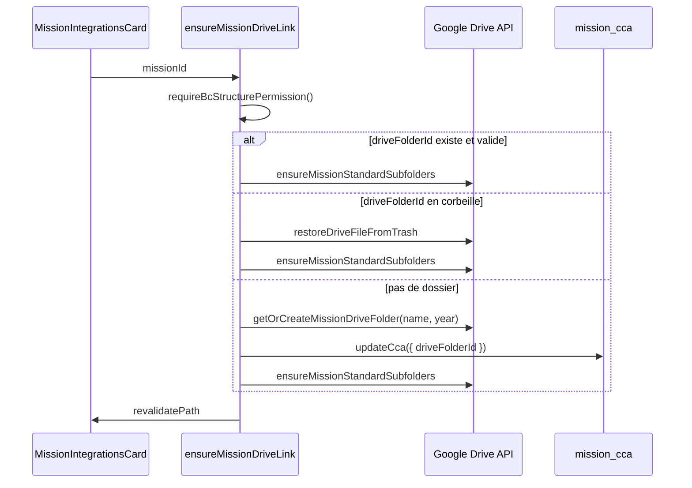
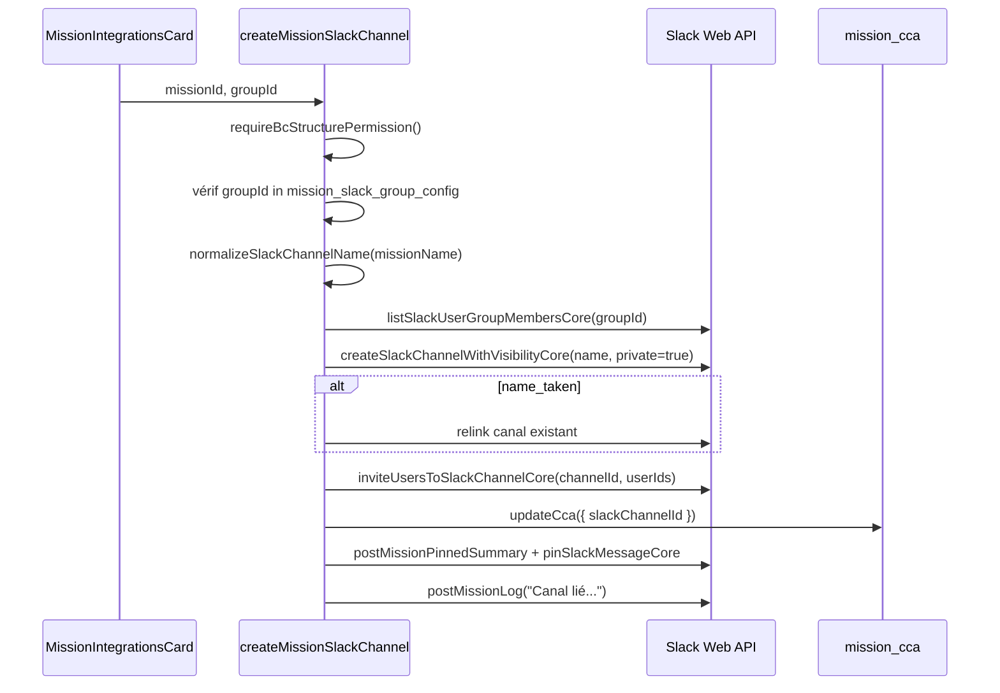
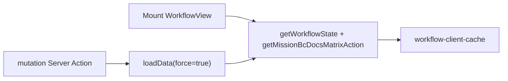

# Guide de réplication — Gestionnaire de Missions

Document de référence pour **comprendre** le Gestionnaire de Missions dans Jaeger et **porter la feature** vers un **autre projet à architecture backend / frontend séparée** (API REST + SPA ou frontend distinct).

**Référence source Jaeger :**

- Feature UI + actions : `src/plugins/features/gestionnaire-missions/`
- Domaine + BDD : `src/plugins/core/mission/`
- Drive : `src/plugins/core/google-workspace/services/drive/index.ts`
- Slack : `src/plugins/core/slack/services/index.ts`

> **Ne pas confondre** avec les missions RFP (`rfp_mission` dans `src/db/rfp-missions.ts`) — domaine distinct, hors périmètre (voir [Annexe A](#annexe-a--hors-périmètre)).

### Comment lire ce guide

| Besoin | Sections |
|--------|----------|
| Démarrer la réplication | §2 Prérequis, §3 Cartographie, §4 Plan par phases, §5 Contrat API |
| Implémenter la BDD | §6 Modèle de données |
| Implémenter le backend (services + règles métier) | §6–§10, §12 Boucles métier |
| Implémenter le frontend | §13 Vues UI, §12.7 (équivalent `useMissionWorkflow`) |
| Valider le portage | §14 Checklist |
| Comprendre le comportement Jaeger d'origine | Tout le document ; les encadrés **« Dans Jaeger »** indiquent l'implémentation actuelle |

---

## Table des matières

1. [Vue d'ensemble et architecture](#1-vue-densemble-et-architecture)
2. [Prérequis projet cible (backend / frontend séparés)](#2-prérequis-projet-cible-backend--frontend-séparés)
3. [Cartographie Jaeger → architecture cible](#3-cartographie-jaeger--architecture-cible)
4. [Plan de réplication par phases](#4-plan-de-réplication-par-phases)
5. [Contrat API REST — mapping des Server Actions Jaeger](#5-contrat-api-rest--mapping-des-server-actions-jaeger)
6. [Modèle de données — schémas BDD](#6-modèle-de-données--schémas-bdd)
7. [Pipeline documentaire et calcul d'état workflow](#7-pipeline-documentaire-et-calcul-détat-workflow)
8. [Matrice documents BDD × Drive](#8-matrice-documents-bdd--drive)
9. [Intégration Google Drive](#9-intégration-google-drive)
10. [Intégration Slack](#10-intégration-slack)
11. [Boucles métier et opérations serveur](#11-boucles-métier-et-opérations-serveur)
12. [Permissions granulaires](#12-permissions-granulaires)
13. [Vues UI et navigation (frontend)](#13-vues-ui-et-navigation-frontend)
14. [Journal d'audit et révisions](#14-journal-daudit-et-révisions)
15. [Checklist de validation](#15-checklist-de-validation)
16. [Pièges connus et limitations](#16-pièges-connus-et-limitations)
17. [Inventaire des fichiers source Jaeger](#17-inventaire-des-fichiers-source-jaeger)

---

## 1. Vue d'ensemble et architecture

### 1.1 Rôle fonctionnel

Le Gestionnaire de Missions est le module du **pôle Commercial** qui permet de :

- Créer et suivre des **missions commerciales** (entité racine **CCA** — Contrat Cadre d'Assistance)
- Gérer la **chaîne documentaire** par bon de commande : BC/BCR → FA → RMI → FS → BV → QS → PVRF
- Générer des documents Word depuis des **templates Google Drive**
- Concilier l'état **base de données** et **Google Drive** via une matrice double (pastilles B / D)
- Lier chaque mission à un **dossier Drive** et un **canal Slack** privé
- Tracer l'historique via un **journal d'événements** et des **tables de révisions**

### 1.2 Architecture plugins

Le système repose sur l'architecture **plugins** de Jaeger :



| Plugin | Rôle | Chemin |
|--------|------|--------|
| `gestionnaire-missions` | UI, Server Actions, permissions | `src/plugins/features/gestionnaire-missions/` |
| `mission` | Schéma Drizzle, repositories, templates | `src/plugins/core/mission/` |
| `google-drive` | API Drive canonique | `src/plugins/core/google-workspace/services/drive/` |
| `slack` | API Slack Web | `src/plugins/core/slack/services/` |

Dépendances déclarées dans [`plugin.json`](src/plugins/features/gestionnaire-missions/plugin.json) :

```json
"requiresPlugins": ["mission", "slack", "google-drive"]
```

### 1.3 Point d'entrée et accès

| Élément | Valeur |
|---------|--------|
| Page | `src/app/(authenticated)/pole/commercial/page.tsx` |
| URL | `/pole/commercial?tab=missions` (alias `?tab=pipeline`) |
| Onglet | « Gestionnaire de missions » |
| Accès | Groupe commercial, admin ou DSI (`canAccessFullCommercialPole`) |
| Activation | `isPluginEnabled("gestionnaire-missions")` |

Chaîne de rendu :

```
CommercialPolePage (RSC)
  └─ GestionnaireMissionsTab (RSC + Suspense)
       └─ GestionnaireMissionsExplorer (client)
            ├─ MissionsView           — liste + pastilles docs
            ├─ MissionDetailView      — fiche + intégrations
            ├─ MissionWorkflowView    — pipeline par BC
            ├─ MissionJournalView     — journal d'événements
            ├─ KpiView                — compteurs globaux
            └─ ConfigView             — Slack, templates, permissions
```

### 1.4 Modèle d'accès aux données

**Dans Jaeger :** pas d'API REST — Server Actions Next.js (`gestionnaire-missions-actions.ts`, `workflow-actions.ts`).

**Projet cible :** implémenter les endpoints §5 ; le frontend ne parle qu'à l'API REST. La route `src/app/api/missions/upload/route.ts` est désactivée (503) — ne pas porter.

### 1.5 Flux end-to-end



### 1.6 Dans Jaeger vs projet cible

| Aspect | Jaeger (monolithe Next.js) | Projet cible (backend / frontend séparés) |
|--------|---------------------------|-------------------------------------------|
| API | **Server Actions** (`"use server"`) — pas de REST | **API REST** (ou GraphQL) exposée par le backend |
| UI | RSC + client components dans la même app | SPA React/Vue/Angular **ou** Next.js frontend-only |
| Accès BDD | Direct depuis Server Actions | **Uniquement backend** (repositories / services) |
| Google Drive | OAuth **utilisateur** via Better Auth session | Backend : token utilisateur **ou** service account + délégation domaine |
| Slack | Tokens serveur (`SLACK_*_TOKEN`) | Identique — **backend uniquement**, jamais le frontend |
| Permissions | Middleware implicite dans chaque action | Middleware HTTP + guards service |
| Cache UI | `workflow-client-cache.ts` + `unstable_cache` KPI | React Query / SWR côté frontend ; Redis optionnel backend |
| Types partagés | Imports TypeScript internes | Package `@org/mission-types` ou OpenAPI généré |

Le reste de ce guide décrit le **comportement métier invariant** ; la section [§5](#5-contrat-api-rest--mapping-des-server-actions-jaeger) traduit chaque Server Action Jaeger en endpoint REST.

---

## 2. Prérequis projet cible (backend / frontend séparés)

### 2.1 Backend

| Dépendance | Usage |
|------------|-------|
| Runtime Node.js 20+ (ou JVM/Go équivalent) | API + workers |
| PostgreSQL | 15+ tables mission (voir §6) |
| ORM | Drizzle ou Prisma — reproduire le schéma §6 |
| Auth | JWT/session ; résolution `userId` + rôles (admin, DSI, commercial) |
| Google APIs | `googleapis` — Drive v3 (dossiers, upload, export Google Doc, conversion PDF) |
| Slack Web API | `@slack/web-api` ou appels HTTP — canaux, messages, pins |
| Docxtemplater + PizZip | Génération DOCX depuis templates (§9.6) |
| (Optionnel) BullMQ / cron | Scan matrice Drive si vous voulez du cache serveur |

**Variables d'environnement backend :**

```env
# Base
DATABASE_URL=
JWT_SECRET=                    # ou mécanisme auth du projet

# Google Drive (obligatoire pour intégration missions)
GOOGLE_CLIENT_ID=
GOOGLE_CLIENT_SECRET=
# Si OAuth par utilisateur : stocker refresh_token par user en BDD
# Si service account : GOOGLE_SERVICE_ACCOUNT_JSON= + DRIVE_MISSIONS_ROOT_ID
DRIVE_MISSIONS_ROOT_ID=

# Slack (obligatoire pour intégration missions)
SLACK_BOT_TOKEN=
SLACK_USER_BOT_TOKEN=          # prioritaire pour création canaux / groupes

# Permissions granulaires (équivalent Jaeger)
GM_PERMISSION_MANAGE_BC_STRUCTURE_USERS=
GM_PERMISSION_MANAGE_BC_STRUCTURE_GROUPS=
GM_PERMISSION_MANAGE_SLACK_GROUPS_USERS=
GM_PERMISSION_MANAGE_SLACK_GROUPS_GROUPS=
GM_PERMISSION_GENERATE_DOC_CCA_USERS=
GM_PERMISSION_GENERATE_DOC_CCA_GROUPS=
GM_PERMISSION_VALIDATE_DOC_CCA_USERS=
# … répéter pour BC, BCR, RMI, ARMI, PVRF
```

### 2.2 Frontend

| Dépendance | Usage |
|------------|-------|
| Framework UI | React 18+ recommandé (portage direct des composants Jaeger) |
| Client HTTP | fetch / axios / ky — appels vers `API_BASE_URL` |
| Cache données | TanStack Query (remplace `useMissionWorkflow` + caches module) |
| UI kit | shadcn/ui ou équivalent (dialogs BC, matrice B/D, tabs) |
| Routing | React Router ou Next.js App Router (pages séparées du backend) |

**Variables frontend :**

```env
VITE_API_BASE_URL=https://api.example.com   # ou NEXT_PUBLIC_API_BASE_URL
```

Le frontend **ne doit pas** contenir `SLACK_*`, secrets Google, ni `GM_PERMISSION_*`.

### 2.3 Package partagé (recommandé)

Créer un module `@org/mission-contracts` exportant :

- DTOs : `MissionRow`, `MissionWorkflowState`, `MissionDocsMatrix`, `GestionnaireMissionsPermissions`, `MissionsKpi`
- Enums : `DocStageStatus`, `BddMatrixStatus`, `DriveMatrixStatus`, `TemplateDocType`
- Constantes : préfixes fichiers Drive (`^BC_`, `^FA_`, …)

Sources Jaeger : [`actions/gestionnaire/types.ts`](src/plugins/features/gestionnaire-missions/actions/gestionnaire/types.ts), [`workflow-db.ts`](src/plugins/core/mission/db/workflow-db.ts), [`docs-matrix-actions.ts`](src/plugins/features/gestionnaire-missions/actions/workflow/docs-matrix-actions.ts).

### 2.4 Tables et entités externes requises

Le gestionnaire mission **dépend** de tables hors plugin mission :

| Table Jaeger | Rôle | À reproduire |
|--------------|------|--------------|
| `user` | CDP, intervenants, auteurs | Oui |
| `commercial_clients` | FK `mission_cca.client_id` | Oui (champs nom/prénom ; chiffrement optionnel) |
| `commercial_entreprises` | FK `mission_cca.entreprise_id` | Oui |
| `google_group_members` | Résolution `GM_PERMISSION_*_GROUPS` | Oui si permissions par groupe Google |
| `slack_channels` | Cache liste canaux (sélecteur liaison) | Recommandé |
| `slack_user_groups` | Config groupes invités | Recommandé |

---

## 3. Cartographie Jaeger → architecture cible



| Fichier / module Jaeger | Couche cible | Notes |
|-------------------------|--------------|-------|
| `src/plugins/core/mission/tables/*` | Backend — migrations | Copier tel quel (adapter noms package) |
| `src/plugins/core/mission/db/*` | Backend — `repositories/` | Logique SQL pure, réutilisable à ~95 % |
| `src/plugins/core/mission/db/workflow-db.ts` | Backend — `WorkflowService` | Aucun changement métier |
| `src/plugins/core/mission/db/revision-db.ts` | Backend — `AuditService` | Invariant |
| `src/plugins/features/.../mutation-actions.ts` | Backend — routes `POST/PATCH` | Remplacer `revalidatePath` par réponse JSON |
| `src/plugins/features/.../docs-matrix-actions.ts` | Backend — `GET .../docs-matrix` | Appels Drive depuis backend |
| `src/plugins/features/.../template-actions.ts` | Backend — `TemplateService` | Docxtemplater côté serveur |
| `src/plugins/features/.../mission-integrations-actions.ts` | Backend — routes `/integrations/*` | |
| `src/plugins/core/google-workspace/services/drive/index.ts` | Backend — `DriveIntegration` | Adapter auth (voir §9.1) |
| `src/plugins/core/slack/services/index.ts` | Backend — `SlackIntegration` | Copier quasi tel quel |
| `src/plugins/features/.../components/*` | Frontend | Remplacer appels Server Actions par `apiClient` |
| `hooks/use-mission-workflow.ts` | Frontend | TanStack Query : `useQuery` + `invalidateQueries` |
| `lib/workflow-client-cache.ts` | Frontend | Remplacé par cache React Query |
| `lib/gm-require-permissions.ts` | Backend — middleware | `requireBcStructurePermission` → guard HTTP 403 |
| `gestionnaire-missions-tab.tsx` (RSC) | Frontend — page loader | `useEffect` ou route loader qui appelle `GET /missions` |

**Système plugins Jaeger** (`plugin.json`, `isPluginEnabled`) : remplacer par feature flag env ou config applicative (`MISSIONS_MODULE_ENABLED=true`).

---

## 4. Plan de réplication par phases

### Phase 1 — Schéma BDD et migrations

1. Copier les tables §6 (15 tables + 4 enums actifs).
2. Appliquer migrations (référence Annexe B).
3. Seed minimal : au moins 1 client, 1 entreprise, 1 user CDP.
4. Vérifier FK et index `(mission_id, changed_at)` sur `mission_document_events`.

**Livrable :** base migrée + repositories CRUD (`cca-db`, `bon-commande-db`, …).

### Phase 2 — Services domaine (sans Drive/Slack)

1. Porter `workflow-db.ts` → `WorkflowService.getByMission`, `getByMissions` (batch).
2. Porter `revision-db.ts` → `AuditService` (révisions + `appendMissionDocumentEvent`).
3. Implémenter mutations BC/docs (logique de `mutation-actions.ts`) avec pattern invariant :

```
guard permission → mutation SQL → createRevision → appendEvent → return DTO
```

4. Tests unitaires : calcul `DocStageStatus`, avenants `replaced_by_id`.

**Livrable :** API CRUD mission + BC + docs testable sans Google.

### Phase 3 — API REST (contrat §5)

1. Exposer endpoints avec auth middleware.
2. Réponses JSON = DTOs du package partagé.
3. Erreurs : `401` non auth, `403` permission, `404` mission/BC introuvable, `422` validation.

**Livrable :** OpenAPI ou collection Postman alignée §5.

### Phase 4 — Intégration Google Drive

1. Porter `drive/index.ts` (create folder, list, upload, convert PDF, metadata).
2. Choisir stratégie OAuth (§9.1) et l'implémenter.
3. Brancher `ensureMissionDriveLink`, matrice docs, génération templates.
4. Créer dossier `Template/` avec fichiers `template_cca.docx`, etc.

**Livrable :** `POST /missions/:id/integrations/drive`, `GET /missions/:id/docs-matrix`, génération CCA test.

### Phase 5 — Intégration Slack

1. Porter `slack/services/index.ts`.
2. Tables cache `slack_channels`, `mission_slack_group_config`.
3. Endpoints création/liaison canal + rename sur update mission.

**Livrable :** canal privé créé, fiche épinglée, rename synchronisé.

### Phase 6 — Templates Word

1. Porter Docxtemplater (`<<TAG>>`), `template-doc-config.ts`, `template-scan.ts`.
2. Endpoints generate / preview / validate / sync templates.
3. Permissions `GENERATE` / `VALIDATE` par type doc.

**Livrable :** DOCX généré sur Drive, validation PDF, `generated_file_id` en BDD.

### Phase 7 — Frontend

1. Porter composants Jaeger (explorer, vues, dialogs).
2. Remplacer Server Actions par client API (§5).
3. Implémenter hook équivalent `useMissionWorkflow` avec TanStack Query.
4. Lazy hydrate liste : `GET /missions/docs-matrix/batch?ids=…`.

**Livrable :** parcours complet liste → workflow → création BC → génération template.

### Phase 8 — Permissions et Config

1. Middleware backend `GM_PERMISSION_*`.
2. Page Config : groupes Slack, sync templates, preview permissions.
3. Endpoint `GET /missions/permissions/me`.

### Phase 9 — Validation finale

Checklist §15.

---

## 5. Contrat API REST — mapping des Server Actions Jaeger

Convention proposée : prefix `/api/v1/missions`. Adapter au standard du projet cible (NestJS, Express, etc.).

**Auth :** header `Authorization: Bearer <token>` sur toutes les routes sauf healthcheck.

**Permissions :** équivalent des guards §12 ; retourner `403` si refus.

### 5.1 Missions — CRUD et liste

| Méthode | Route | Server Action Jaeger | Corps / query | Réponse |
|---------|-------|---------------------|---------------|---------|
| `GET` | `/missions` | `getMissionsList` | `?limit=50` | `{ missions: MissionRow[] }` |
| `GET` | `/missions/kpi` | `getMissionsKpi` | — | `MissionsKpi` |
| `GET` | `/missions/form-options` | `getMissionFormOptions` | — | clients, entreprises, cdp |
| `GET` | `/missions/:missionId` | `getMissionById` | — | `MissionRow` |
| `POST` | `/missions` | `createMissionAction` | `CreateMissionInput` | `{ id }` |
| `PATCH` | `/missions/:missionId` | `updateMissionAction` | `UpdateMissionInput` | `204` (+ rename Drive/Slack async côté serveur) |
| `POST` | `/missions/docs-matrix/hydrate` | `hydrateMissionsDocsMatricesForListAction` | `{ missionIds: string[] }` | `Record<id, MissionMissionLevelDocs>` |

### 5.2 Workflow — lecture

| Méthode | Route | Server Action Jaeger | Réponse |
|---------|-------|---------------------|---------|
| `GET` | `/missions/:missionId/workflow` | `getWorkflowState` | `MissionWorkflowState` |
| `GET` | `/missions/:missionId/docs-matrix` | `getMissionBcDocsMatrixAction` | `MissionDocsMatrix` |
| `GET` | `/missions/:missionId/events` | `getMissionEvents` | `MissionDocumentEvent[]` |
| `GET` | `/missions/:missionId/bcs/:bcId/editor` | `getBcEditorDataAction` | données éditeur BC |
| `GET` | `/intervenants/options` | `listIntervenantOptions` | `{ id, label }[]` |

### 5.3 Bons de commande et structure

| Méthode | Route | Server Action Jaeger | Corps |
|---------|-------|---------------------|-------|
| `POST` | `/missions/:missionId/bcs` | `createBcAction` | `{ bcNumber, designations?, frais? }` |
| `PATCH` | `/missions/:missionId/bcs/:bcId` | `updateBcAction` | champs BC |
| `PUT` | `/missions/:missionId/bcs/:bcId/structure` | `updateBcStructureAction` | structure complète |
| `PATCH` | `/missions/:missionId/bcs/:bcId/designations/:desId/intervenant` | `assignDesignationIntervenantAction` | `{ intervenantId }` |

### 5.4 Documents par BC

| Méthode | Route | Server Action Jaeger |
|---------|-------|---------------------|
| `POST` | `.../bcs/:bcId/fa` | `createFaAction` |
| `PATCH` | `.../bcs/:bcId/fa/:faId` | `updateFaAction` |
| `POST` | `.../bcs/:bcId/fs` | `createFsAction` |
| `PATCH` | `.../bcs/:bcId/fs/:fsId` | `updateFsAction` |
| `POST` | `.../bcs/:bcId/rmi` | `createRmiAction` |
| `POST` | `.../bcs/:bcId/rmi/per-intervenant` | `createRmiPerIntervenantAction` |
| `PATCH` | `.../bcs/:bcId/rmi/:rmiId` | `updateRmiAction` |
| `POST` | `.../bcs/:bcId/bv` | `createBvAction` |
| `POST` | `.../bcs/:bcId/bv/per-intervenant` | `createBvPerIntervenantAction` |
| `PATCH` | `.../bcs/:bcId/bv/:bvId` | `updateBvAction` |
| `POST` | `.../bcs/:bcId/pvrf` | `createPvrfAction` |
| `PATCH` | `.../bcs/:bcId/pvrf/:pvrfId` | `updatePvrfAction` |
| `POST` | `.../bcs/:bcId/qs` | `createQsAction` |
| `PATCH` | `.../bcs/:bcId/qs/:qsId` | `updateQsAction` |

Chaque mutation réussie retourne `204` ou `{ workflow: MissionWorkflowState }` si le frontend préfère éviter un second GET.

### 5.5 Templates Word

| Méthode | Route | Server Action Jaeger | Corps | Réponse |
|---------|-------|---------------------|-------|---------|
| `GET` | `/missions/:missionId/templates/form-data` | `getMissionTemplateGenerationFormDataAction` | `?bcId=&documentType=` | prefill + targets |
| `POST` | `/missions/:missionId/templates/generate` | `generateMissionTemplateDocumentAction` | `{ bcId?, documentType, documentNumber, values, perTargetValues? }` | `{ docxUrl, pdfUrl? }` |
| `POST` | `/missions/:missionId/templates/preview` | `previewMissionTemplateDocumentAction` | idem | `{ docxUrl, targetLabel? }` |
| `POST` | `/missions/:missionId/templates/dry-run` | `previewMissionTemplateDryRunAction` | idem | audit balises |
| `GET` | `/missions/:missionId/templates/pending-docx` | `listPendingTemplateDocxAction` | `?bcId=&documentType=` | `PendingTemplateFile[]` |
| `POST` | `/missions/:missionId/templates/validate` | `validateTemplateDocxAction` | `{ bcId?, documentType, docxFileId, outputBaseName? }` | `{ pdfUrl }` |
| `POST` | `/admin/mission-templates/sync` | `listDriveMissionTemplatesWithTagsAction` | — | scan Template/ → `gm_drive_template_tags` |

### 5.6 Intégrations Drive et Slack

| Méthode | Route | Server Action Jaeger |
|---------|-------|---------------------|
| `GET` | `/missions/:missionId/integrations` | `getMissionIntegrationState` |
| `POST` | `/missions/:missionId/integrations/drive` | `ensureMissionDriveLink` |
| `POST` | `/missions/:missionId/integrations/slack/channel` | `createMissionSlackChannel` — `{ groupId }` |
| `PUT` | `/missions/:missionId/integrations/slack/channel` | `linkMissionSlackChannel` — `{ channelId }` |
| `POST` | `/missions/:missionId/integrations/slack/debug-message` | `debugSendMissionSlackMessage` (admin) |
| `POST` | `/missions/:missionId/integrations/slack/debug-group-tag` | `debugSendMissionSlackGroupTagMessage` (admin) |

### 5.7 Configuration et permissions

| Méthode | Route | Server Action Jaeger |
|---------|-------|---------------------|
| `GET` | `/missions/permissions/me` | `getGestionnaireMissionsPermissionsAction` |
| `GET` | `/missions/config/slack-groups` | `getMissionSlackGroupOptions` |
| `PUT` | `/missions/config/slack-groups` | `updateMissionSlackGroupConfigAction` — `{ groupIds: string[] }` |

### 5.8 Exemple client frontend (React Query)

```typescript
// frontend/src/api/missions.ts
export async function fetchWorkflow(missionId: string, token: string) {
  const res = await fetch(`${API_BASE}/missions/${missionId}/workflow`, {
    headers: { Authorization: `Bearer ${token}` },
  });
  if (!res.ok) throw new Error(await res.text());
  return res.json() as Promise<MissionWorkflowState>;
}

// frontend/src/hooks/use-mission-workflow.ts — remplace Jaeger
export function useMissionWorkflow(missionId: string) {
  const qc = useQueryClient();
  const workflow = useQuery({
    queryKey: ["mission-workflow", missionId],
    queryFn: () => fetchWorkflow(missionId, getToken()),
  });
  const matrix = useQuery({
    queryKey: ["mission-docs-matrix", missionId],
    queryFn: () => fetchDocsMatrix(missionId, getToken()),
  });
  const reload = () => {
    qc.invalidateQueries({ queryKey: ["mission-workflow", missionId] });
    qc.invalidateQueries({ queryKey: ["mission-docs-matrix", missionId] });
  };
  return { workflow, matrix, reload };
}
```

### 5.9 OAuth Google en architecture séparée

Jaeger passe le token Google de l'utilisateur connecté à chaque appel Drive. En backend séparé, **trois options** :

| Option | Quand l'utiliser | Implémentation |
|--------|------------------|----------------|
| **A — Token utilisateur stocké** | Parité Jaeger, actions Drive = user | Table `user_google_tokens` ; frontend initie OAuth ; backend utilise refresh_token de l'user appelant |
| **B — Service account + DWD** | Workspace Google, accès org-wide | Compte de service avec délégation domain-wide ; backend agit au nom d'un admin technique |
| **C — Hybride** | Lecture admin, écriture user | Service account pour scans/listings ; OAuth user pour upload si policy stricte |

Pour la **matrice docs** et **génération templates**, l'option A ou B est requise — le backend doit pouvoir appeler `files.list` et `files.create` sans passer par le browser.

---

## 6. Modèle de données — schémas BDD

### 6.1 Stack ORM

| Technologie | Détail |
|-------------|--------|
| ORM | Drizzle ORM (PostgreSQL) |
| Schémas | `src/plugins/core/mission/tables/` |
| Agrégation | `src/db/schema.ts` → re-export via `src/db/mission-core.ts` |
| Migrations | `drizzle/` (journal : `drizzle/meta/_journal.json`) |

### 6.2 Diagramme entité-relation



**Hiérarchie documentaire :**

```
mission_cca (CCA)
├── mission_bon_commande (BC/BCR) ── replaced_by_id (avenants)
│   ├── mission_bc_designation
│   ├── mission_bc_frais
│   ├── mission_rmi ── replaced_by_id (avenants ARMI/AARMI)
│   │   └── mission_rmi_intervenant_assignation
│   ├── mission_fa (regle/regle_at)
│   ├── mission_fs (regle/regle_at, multi-lignes → avenant)
│   ├── mission_bv (verse/verse_at, multi-lignes → avenant)
│   ├── mission_pvrf
│   └── mission_qs
├── mission_document_events (journal global)
├── mission_*_revision (7 tables audit)
├── mission_slack_group_config
└── gm_drive_template_tags
```

### 6.3 Tables détaillées

#### `mission_cca` — Mission racine

Fichier : [`src/plugins/core/mission/tables/cca.ts`](src/plugins/core/mission/tables/cca.ts)

| Colonne SQL | Type | Sémantique |
|-------------|------|------------|
| `id` | text PK | Identifiant UUID |
| `client_id` | text FK → `commercial_clients` | Client de la mission |
| `entreprise_id` | text FK → `commercial_entreprises` | Entité juridique |
| `cdp_id` | text FK → `user` | Chef de projet |
| `mission_name` | text | Nom affiché (Drive, Slack, UI) |
| `description` | text | Description libre |
| `start_date` / `end_date` | timestamp | Dates mission |
| `created_by` / `updated_by` | text FK → `user` | Audit utilisateur |
| `created_at` / `updated_at` | timestamp | Horodatage |
| `drive_folder_id` | text | ID dossier Google Drive |
| `generated_file_id` | text | Dernier CCA généré (réf. Drive) |
| `slack_channel_id` | text | ID canal Slack lié |

#### `mission_bon_commande` — BC / BCR

Fichier : [`src/plugins/core/mission/tables/bon-commande.ts`](src/plugins/core/mission/tables/bon-commande.ts)

| Colonne SQL | Type | Sémantique |
|-------------|------|------------|
| `id` | text PK | |
| `cca_id` | text FK → `mission_cca` ON DELETE CASCADE | |
| `replaced_by_id` | text FK auto-réf. | Lien avenant BCR → BC remplacé |
| `type` | enum `bon_commande_type` | `BC` ou `BCR` |
| `bc_number` | text | Numéro affiché (ex. BC01) |
| `livre` | boolean | BC livré → débloque phase clôture |
| `planning_date` / `planning_end_date` | timestamp | Dates planning avant-vente |
| `generated_file_id` | text | Dernier BC/BCR généré |
| `created_by` / `updated_by` | text FK → `user` | |

#### `mission_bc_designation` — Lignes de désignation

| Colonne SQL | Type | Sémantique |
|-------------|------|------------|
| `id` | text PK | |
| `bc_id` | text FK → `mission_bon_commande` | |
| `intervenant_id` | text FK → `user` | Étudiant assigné |
| `titre` / `description` | text | Libellés |
| `nb_jeh` | integer | Nombre de JEH |
| `montant_jeh` | decimal(10,2) | Tarif unitaire |
| `prix_total_ht` / `tva` / `total_ttc` | decimal(10,2) | Montants |
| `order` | integer | Ordre d'affichage |

#### `mission_bc_frais` — Frais BC

| Colonne SQL | Type |
|-------------|------|
| `id`, `bc_id`, `texte`, `montant_ht`, `tva`, `total_ttc`, `order` | |

#### `mission_rmi` — RMI / ARMI / AARMI

Fichier : [`src/plugins/core/mission/tables/rmi.ts`](src/plugins/core/mission/tables/rmi.ts)

| Colonne SQL | Type | Sémantique |
|-------------|------|------------|
| `type` | enum `rmi_type` | `RMI`, `ARMI`, `AARMI` |
| `replaced_by_id` | text FK auto-réf. | Chaîne d'avenants |
| `rmi_number` | text | Numéro document |
| `generated_file_id` | text | Fichier Drive |
| `meeting_date` | timestamp | Date réunion |
| `participants` / `notes` | text | |

#### `mission_rmi_intervenant_assignation`

Lie un intervenant à un RMI, optionnellement à une désignation BC, avec `start_date`, `deadline`, `notes`.

#### `mission_fa` — Facture d'acompte

| Colonne notable | Sémantique |
|-----------------|------------|
| `fa_number`, `amount`, `currency`, `issue_date`, `due_date` | Données facture |
| `regle` / `regle_at` | Facture payée (préparation trésorerie) |
| `generated_file_id` | Fichier Drive |

#### `mission_fs` — Facture de solde

Structure identique à FA. **Plusieurs lignes FS par BC** possibles → statut workflow `avenant` si count > 1.

#### `mission_bv` — Bon de virement

| Colonne notable | Sémantique |
|-----------------|------------|
| `intervenant_id` | Bénéficiaire |
| `beneficiary`, `iban` | Coordonnées bancaires |
| `verse` / `verse_at` | Virement effectué |
| `generated_file_id` | Fichier Drive |

Plusieurs BV par BC possibles (un par intervenant).

#### `mission_pvrf` — Procès-verbal réception finale

| Colonne notable | Sémantique |
|-----------------|------------|
| `client_validated` / `entreprise_validated` | Attestations |
| `validation_date`, `validated_by` | Validation |
| `generated_file_id` | Fichier Drive |

#### `mission_qs` — Qualité & Sécurité (PVRI)

| Colonne notable | Sémantique |
|-----------------|------------|
| `qs_number`, `validation_date`, `validated_by`, `notes` | |
| `generated_file_id` | Fichier Drive |

### 6.4 Tables audit et configuration

#### Tables de révision (`mission_*_revision`)

7 tables homologues (BC, RMI, FA, FS, BV, PVRF, QS) — fichier [`revisions.ts`](src/plugins/core/mission/tables/revisions.ts) :

| Colonne | Type | Sémantique |
|---------|------|------------|
| `entity_id` | text | ID entité révisée |
| `revision_number` | integer | Numéro incrémental |
| `change_type` | enum `revision_change_type` | `create`, `update`, `avenant` |
| `payload_snapshot` | jsonb | Copie état au moment du changement |
| `changed_by` | text FK → `user` | |
| `reason` | text | Motif libre |
| `changed_at` | timestamp | |

Index : `(entity_id, revision_number)`.

#### `mission_document_events` — Journal global

| Colonne | Type | Sémantique |
|---------|------|------------|
| `mission_id` | text FK → `mission_cca` | |
| `bc_id` | text FK → `mission_bon_commande` | Optionnel |
| `entity_type` | text | `bc`, `rmi`, `fa`, `fs`, `bv`, `pvrf`, `qs` |
| `entity_id` | text | ID entité concernée |
| `event_type` | enum | Voir section 10 |
| `revision_number` | integer | |
| `label` | text | Texte affiché dans le feed UI |
| `changed_by` / `changed_at` | | |

Index : `(mission_id, changed_at)`, `(bc_id)`.

#### `mission_slack_group_config`

| Colonne | Type | Sémantique |
|---------|------|------------|
| `group_id` | text PK | ID groupe Slack invitable à la création canal |
| `created_at` / `updated_at` | timestamp | |

#### `gm_drive_template_tags`

| Colonne | Type | Sémantique |
|---------|------|------------|
| `doc_type` | text PK | CCA, BC, BCR, RMI, ARMI, PVRF |
| `drive_file_id` | text | ID fichier template Drive |
| `drive_file_name` | text | Nom fichier |
| `tags` | jsonb (string[]) | Balises extraites du DOCX |
| `synced_at` | timestamp | Dernière synchro depuis Config |

### 6.5 Enums PostgreSQL actifs

| Enum | Valeurs | Usage |
|------|---------|-------|
| `bon_commande_type` | `BC`, `BCR` | `mission_bon_commande.type` |
| `rmi_type` | `RMI`, `ARMI`, `AARMI` | `mission_rmi.type` |
| `revision_change_type` | `create`, `update`, `avenant` | Tables révision |
| `mission_document_event_type` | 21 valeurs (voir §10) | Journal |

Source : [`enums.ts`](src/plugins/core/mission/tables/enums.ts), [`revisions.ts`](src/plugins/core/mission/tables/revisions.ts).

### 6.6 Enums et tables legacy (supprimés)

| Élément | Statut |
|---------|--------|
| `document_status` | Enum peut exister en DB ; colonnes `status` supprimées (migration 0044) |
| `generation_status` | Colonnes supprimées (migration 0044) |
| `mission_generation_request` | Table supprimée (migration 0039) |
| `mission_permissions_config` | Créée puis supprimée (migrations 0048 → 0049) |
| `pipeline_state` sur CCA | Supprimé (migration 0038) |

Les permissions sont désormais gérées via variables d'environnement `GM_PERMISSION_*` (voir §8).

### 6.7 Statuts métier non-enum

| Champ | Table(s) | Sémantique |
|-------|----------|------------|
| `livre` | `mission_bon_commande` | BC livré → débloque clôture |
| `regle` / `regle_at` | `mission_fa`, `mission_fs` | Facture payée |
| `verse` / `verse_at` | `mission_bv` | Virement effectué |
| `client_validated` / `entreprise_validated` | `mission_pvrf` | Attestations validation |

---

## 7. Pipeline documentaire et calcul d'état workflow

### 7.1 Ordre UI du pipeline

**Niveau mission** (dossier Drive racine) :

```
Propale → CDC → CCA
```

Propale et CDC : présence PDF dans sous-dossiers Drive uniquement (pas de suivi BDD).

**Par bon de commande** :

```
FA (optionnel) → RMI → FS → BV (optionnel) → QS/PVRI (optionnel) → PVRF
```

Source : [`mission-workflow-view.tsx`](src/plugins/features/gestionnaire-missions/components/mission-workflow-view.tsx).

### 7.2 Pas de state machine formelle

Il n'existe **pas** de librairie type XState. Le workflow est modélisé par :

1. **Statuts de présence** (`DocStageStatus`) : `absent` | `present` | `avenant`
2. **Matrice double** BDD/Drive (pastilles B / D)
3. **Chaînes d'avenants** via `replaced_by_id` (BC, RMI)
4. **Journal d'événements** + tables de révisions

### 7.3 Calcul `DocStageStatus`

Source : [`workflow-db.ts`](src/plugins/core/mission/db/workflow-db.ts).

```typescript
type DocStageStatus = "absent" | "present" | "avenant";

function multiDocStatus(count: number): DocStageStatus {
  if (count === 0) return "absent";
  return count > 1 ? "avenant" : "present";
}

function singleDocWithChainStatus(
  row: { replacedById?: string | null } | null,
): DocStageStatus {
  if (!row) return "absent";
  return row.replacedById ? "avenant" : "present";
}

function singleDocPresent(row: object | null): DocStageStatus {
  return row ? "present" : "absent";
}
```

**Application par type de document :**

| Document | Fonction de calcul | Règle |
|----------|-------------------|-------|
| FA | `singleDocPresent` | 0 ou 1 ligne |
| FS | `multiDocStatus(count)` | > 1 ligne → `avenant` |
| RMI | `singleDocWithChainStatus` | `replacedById` non null → `avenant` |
| BV | `multiDocStatus(count)` | > 1 ligne → `avenant` |
| PVRF | `singleDocPresent` | 0 ou 1 ligne |
| QS | `singleDocPresent` | 0 ou 1 ligne |

Pour chaque BC, seule la **ligne la plus récente** est retenue pour FA, RMI, PVRF, QS (tri `createdAt DESC`, index `[0]`). FS et BV conservent **toutes** les lignes.

### 7.4 Fonctions d'agrégation

| Fonction | Usage | Performance |
|----------|-------|-------------|
| `getWorkflowStateByMission(missionId)` | Détail mission (vue Workflow) | N × requêtes par BC |
| `getWorkflowStatesByMissions(ids[])` | Liste missions | **9 requêtes SQL** pour N missions |
| `getWorkflowStateByBc(bc)` | État d'un BC isolé | 8 requêtes |

Type retourné :

```typescript
type MissionWorkflowState = {
  missionId: string;
  bcs: BcWorkflowState[];
};

type BcWorkflowState = {
  bc: BonCommandeSelect;
  designations: BonCommandeDesignationSelect[];
  frais: BonCommandeFraisSelect[];
  fa: FASelect | null;
  fs: FSSelect[];
  rmi: RMISelect | null;
  bv: BVSelect[];
  pvrf: PVRFSelect | null;
  qs: QSSelect | null;
  stages: { fa, fs, rmi, bv, pvrf, qs: DocStageStatus };
};
```

### 7.5 Chaîne d'avenants

**BC/BCR :** un BCR (`type = BCR`) référence le BC qu'il remplace via `replaced_by_id`. L'ancien BC reçoit le statut `avenant` dans l'UI.

**RMI/ARMI/AARMI :** même mécanisme sur `mission_rmi.replaced_by_id`. Un RMI avec `replacedById` non null est considéré comme remplacé (statut `avenant`).

**FS/BV :** pas de chaîne `replaced_by_id` — la multiplicité de lignes déclenche directement le statut `avenant`.

---

## 8. Matrice documents BDD × Drive

### 8.1 Principe

Chaque document (DOCX et PDF) est représenté par une cellule à **deux pastilles** :

- **B** (BDD) : cycle de vie entité + `generated_file_id`
- **D** (Drive) : présence fichier dans le dossier, corbeille, cohérence

Source : [`docs-matrix-actions.ts`](src/plugins/features/gestionnaire-missions/actions/workflow/docs-matrix-actions.ts).

### 8.2 Statuts matrice

#### Côté BDD (`BddMatrixStatus`)

| Statut | Signification |
|--------|---------------|
| `absent` | Pas d'entité en base |
| `pending_drive` | Entité présente, pas de `generated_file_id` |
| `synced` | Entité + référence fichier en base |
| `inconsistency` | Incohérence (ex. multi-lignes FS/BV sans ref, chaîne RMI avenant) |
| `error` | Erreur (réservé) |

#### Côté Drive (`DriveMatrixStatus`)

| Statut | Signification |
|--------|---------------|
| `absent` | Aucun fichier correspondant au préfixe dans le dossier |
| `present` | Fichier présent (DOCX en attente validation ou PDF validé) |
| `trashed` | `generated_file_id` pointe vers un fichier en corbeille ou inexistant |
| `inconsistency` | DOCX résiduel alors que PDF est présent |

### 8.3 Structure retournée

```typescript
type DocMatrixCell = {
  bdd: BddMatrixStatus;
  drive: DriveMatrixStatus;
  issueBdd?: string;   // message explicatif UI
  issueDrive?: string;
};

type MissionDocsMatrix = {
  mission: {
    cdc: { docx, pdf: DocMatrixCell };
    propale: { docx, pdf: DocMatrixCell };
    cca: { docx, pdf: DocMatrixCell };
  };
  rows: MissionBcDocsMatrixRow[];  // une ligne par BC
};
```

Chaque ligne BC contient 14 cellules : `bcDocx`, `bcPdf`, `faDocx`, `faPdf`, `fsDocx`, `fsPdf`, `rmiDocx`, `rmiPdf`, `pvrfDocx`, `pvrfPdf`, `bvDocx`, `bvPdf`, `qsDocx`, `qsPdf`.

### 8.4 Conventions de nommage Drive

Fichiers détectés par **préfixe regex** dans le dossier `BC-{numéro}` :

| Document | Préfixe fichier |
|----------|----------------|
| BC/BCR | `^BC_` ou `^BCR_` |
| FA | `^FA_` |
| FS | `^FS_` |
| RMI/ARMI | `^RMI_` ou `^ARMI_` |
| BV | `^BV_` |
| PVRF | `^PVRF_` |
| QS | `^QS_` |
| CCA (racine mission) | `^CCA_` |

Extension `.docx` ou `.pdf` requise.

### 8.5 Arborescence Drive scannée

```
{drive_folder_id}/           ← racine mission
├── Propale/                 ← PDF only (pas de suivi BDD)
├── CDC/                     ← PDF only
├── CCA_*.docx / CCA_*.pdf   ← niveau mission
└── BC-{bcNumber}/           ← un sous-dossier par BC
    ├── BC_*.docx / BC_*.pdf
    ├── FA_*.docx / FA_*.pdf
    ├── FS_*.docx / FS_*.pdf
    ├── RMI_*.docx / RMI_*.pdf
    ├── BV_*.docx / BV_*.pdf
    ├── PVRF_*.docx / PVRF_*.pdf
    └── QS_*.docx / QS_*.pdf
```

### 8.6 Boucle d'hydratation lazy (liste missions)



- **Chargement initial liste** : `getMissionsList` → workflow batch **sans** scan Drive complet
- **Hydratation différée** : `hydrateMissionsDocsMatricesForListAction` côté client pour les pastilles mission-level
- **Vue Workflow** : `getMissionBcDocsMatrixAction` scanne tous les BC + Drive en une passe

### 8.7 Overlay PDF tracké

Si `generated_file_id` pointe vers un PDF (post-validation), le statut Drive du PDF reflète ce fichier même si son nom ne matche pas le préfixe attendu (`applyTrackedPdfOverlayToDrivePair`).

---

## 9. Intégration Google Drive

### 9.1 Authentification

| Composant | Fichier | Rôle |
|-----------|---------|------|
| Better Auth + Google OAuth | `src/lib/auth.ts` | Scopes `drive`, `drive.file`, `drive.readonly` ; `accessType: offline` |
| Token session | `src/plugins/core/google-auth/services/google-api-auth.ts` | `getOAuth2Client()`, `getGoogleAccessToken()` |
| Client Drive | `src/plugins/core/google-workspace/services/clients/index.ts` | `getDriveClient()` |

**Pas de service account** — chaque appel Drive utilise la session OAuth de l'utilisateur connecté.

Legacy `src/service/google.ts` interdit par Biome ; utiliser exclusivement le plugin Drive.

### 9.2 Service central Drive

Fichier canonique : [`src/plugins/core/google-workspace/services/drive/index.ts`](src/plugins/core/google-workspace/services/drive/index.ts).

| Fonction | Usage missions |
|----------|----------------|
| `createDriveFolder` / `createDriveFolderInParent` | Création dossiers |
| `getOrCreateSubfolder` | Idempotent, anti-doublon via Map de promesses |
| `getOrCreateMissionDriveFolder` | `{ROOT}/{année}/{nomMission}` |
| `ensureMissionStandardSubfolders` | Crée `Propale/` et `CDC/` |
| `listFilesInFolder` | Listing paginé (`trashed = false`) |
| `uploadFileToDriveWithId` | Upload buffer → Drive, retourne `{ id, webViewLink }` |
| `convertDriveDocxToPdfAndDelete` | Validation : DOCX → PDF, suppression DOCX |
| `getDriveFileMetadata` / `getDriveFileState` | Existence, corbeille, mimeType |
| `renameDriveFile` | Renommage dossier mission |
| `restoreDriveFileFromTrash` | Restauration dossier supprimé |

Constantes :

```typescript
export const DRIVE_MISSIONS_ROOT_ID =
  process.env.DRIVE_MISSIONS_ROOT_ID ?? "17jSWF2Pugj0HhBHkQFuHnnUEMCnvXRvR";

export const MISSION_DRIVE_SUBFOLDER_TEMPLATE = "Template";
export const MISSION_DRIVE_SUBFOLDER_CDC = "CDC";
export const MISSION_DRIVE_SUBFOLDER_PROPALE = "Propale";
```

### 9.3 Arborescence Drive standard

```
DRIVE_MISSIONS_ROOT_ID/
├── Template/                    ← modèles DOCX / Google Docs (balises)
├── 2026/
│   └── {Nom_Mission}/
│       ├── Propale/
│       ├── CDC/
│       └── BC-{numéro}/         ← docs générés par BC
```

L'année est dérivée de `start_date` (ou `updated_at`, ou année courante).

### 9.4 Flux « Créer/lier dossier Drive »

Action : `ensureMissionDriveLink` — [`mission-integrations-actions.ts`](src/plugins/features/gestionnaire-missions/actions/gestionnaire/mission-integrations-actions.ts).



### 9.5 État intégration Drive

`getMissionIntegrationState(missionId)` retourne :

```typescript
drive: {
  linked: boolean;      // driveFolderId non null
  valid: boolean;       // existe et pas en corbeille
  issue: string | null; // "Dossier Drive non existant." | "en corbeille."
  url: string | null;   // https://drive.google.com/drive/folders/{id}
}
statusColor: "gray" | "green" | "orange"
```

Couleur globale : vert si Drive **et** Slack liés et valides ; orange si lié mais invalide ; gris sinon.

### 9.6 Génération templates Word

Types supportés : `CCA`, `BC`, `BCR`, `RMI`, `ARMI`, `PVRF`.

**Flux `generateMissionTemplateDocumentAction` :**

1. Vérification permission `GM_PERMISSION_GENERATE_DOC_{type}`
2. Résolution dossier cible (`resolveTemplateTargetFolder`) :
   - CCA → racine dossier mission
   - BC/BCR/RMI/ARMI/PVRF → sous-dossier `BC-{numéro}`
3. Lecture template depuis `Template/` (DOCX ou export Google Doc)
4. Remplissage balises via Docxtemplater (`<<TAG>>`)
5. Upload DOCX → Drive (`uploadFileToDriveWithId`)
6. Mise à jour `generated_file_id` en BDD (table selon type)
7. Événement journal (`appendMissionDocumentEvent`)

**Cas particulier RMI :** un document par intervenant assigné aux désignations du BC ; suffixe `-01`, `-02`… sur le numéro.

**Flux `validateTemplateDocxAction` :**

1. Permission `GM_PERMISSION_VALIDATE_DOC_{type}`
2. `convertDriveDocxToPdfAndDelete(docxFileId, folderId, outputName.pdf)`
3. Mise à jour `generated_file_id` → ID du PDF
4. Retour `{ pdfUrl }`

**Prévisualisation :** `previewMissionTemplateDocumentAction`, `previewMissionTemplateDryRunAction` (sans persistance BDD).

**DOCX en attente :** `listPendingTemplateDocxAction` liste les DOCX non validés dans un dossier.

Liste complète des balises : [`src/plugins/features/gestionnaire-missions/readme.md`](src/plugins/features/gestionnaire-missions/readme.md).

### 9.7 Sync templates (`gm_drive_template_tags`)

Action admin : `listDriveMissionTemplatesWithTagsAction`

1. Scan dossier `Template/` sous `DRIVE_MISSIONS_ROOT_ID`
2. Extraction balises `<<…>>` / `{{…}}` de chaque DOCX / Google Doc
3. Upsert en base : `doc_type`, `drive_file_id`, `tags`, `synced_at`
4. Détection balises inconnues vs catalogue canonique

**Pas de webhook Drive** — synchro manuelle depuis l'onglet Config.

### 9.8 Renommage mission → sync Drive

Lors de `updateMissionAction`, si `missionName` change :

```typescript
if (missionBefore.driveFolderId)
  await renameDriveFile(missionBefore.driveFolderId, nextMissionName);
```

### 9.9 Variables d'environnement Drive

| Variable | Rôle | Défaut |
|----------|------|--------|
| `GOOGLE_CLIENT_ID` | OAuth | — |
| `GOOGLE_CLIENT_SECRET` | OAuth | — |
| `BETTER_AUTH_SECRET` | Sessions | — |
| `BETTER_AUTH_URL` | Callback OAuth | — |
| `DRIVE_MISSIONS_ROOT_ID` | Racine Shared Drive missions + Template | `17jSWF2Pugj0HhBHkQFuHnnUEMCnvXRvR` |

---

## 10. Intégration Slack

### 10.1 Deux stacks Slack dans Jaeger

| Stack | Usage missions | Fichier |
|-------|----------------|---------|
| **Web API (OAuth tokens)** | Canaux mission, messages, pins | `src/plugins/core/slack/services/index.ts` |
| **Incoming Webhooks** | **Hors missions** (Communication, tickets, blog) | `src/app/(authenticated)/pole/communication/slack-actions.ts` |

**Pas d'Events API** — aucun endpoint entrant Slack pour les missions. Pas de Block Kit, pas de boutons/modals Slack natifs ; les interactions sont des composants React dans Jaeger.

### 10.2 Lien mission ↔ canal

Champ `mission_cca.slack_channel_id` — gestion manuelle ou automatique depuis la fiche mission (`MissionIntegrationsCard`).

Cache canaux workspace : table `slack_channels` (synchro via Admin → Slack Explorer).

### 10.3 Flux création canal mission

Action : `createMissionSlackChannel(missionId, groupId)`.



### 10.4 Liaison canal existant

`linkMissionSlackChannel(missionId, channelId)` :

1. `updateCca({ slackChannelId: channelId })`
2. `postMissionPinnedSummary` + `postMissionLog`

### 10.5 Messages Slack mission

| Type | Format | Fonction |
|------|--------|----------|
| Fiche épinglée | `📌 *Fiche mission*` + puces (nom, client, CDP, dates, description, ID) | `buildMissionPinnedMessage` → `postMissionPinnedSummary` → `pins.add` |
| Journal | `📝 *Journal mission*\n...` | `postMissionLog` |
| Debug admin | `🧪 *Debug envoi mission*` | `debugSendMissionSlackMessage` |
| Debug tag groupe | `🧪 *Debug tag groupe Slack*` + `<!subteam^GROUP_ID>` | `debugSendMissionSlackGroupTagMessage` |

Format : texte brut avec `mrkdwn: true` via `chat.postMessage`.

### 10.6 API Slack utilisées (missions)

```
conversations.list, conversations.create, conversations.invite,
conversations.rename, conversations.info,
usergroups.users.list, auth.test,
chat.postMessage, pins.add
```

### 10.7 Déclencheurs automatiques vs manuels

| Événement | Action Slack |
|-----------|--------------|
| Création mission (`createMissionAction`) | **Aucune** |
| Renommage mission (`updateMissionAction`) | `renameSlackChannelCore` si canal lié |
| Création canal (`createMissionSlackChannel`) | Fiche épinglée + log |
| Liaison canal (`linkMissionSlackChannel`) | Fiche épinglée + log |
| Mutations BC/docs (createBc, createRmi, etc.) | **Aucune** |
| Génération/validation template | **Aucune** (événement journal BDD uniquement) |

### 10.8 Configuration groupes Slack

Table `mission_slack_group_config` : liste des groupes Slack invités automatiquement à la création d'un canal mission.

- CRUD : `listMissionSlackGroupConfigIds` / `replaceMissionSlackGroupConfigIds`
- UI : onglet Config → checkboxes groupes
- Permission : `GM_PERMISSION_MANAGE_SLACK_GROUPS` (ou admin/DSI)

### 10.9 Variables d'environnement Slack

| Variable | Rôle |
|----------|------|
| `SLACK_BOT_TOKEN` | Token bot `xoxb-…` — requis plugin ; `chat.postMessage` |
| `SLACK_USER_BOT_TOKEN` | Token user admin — **prioritaire** pour gestion canaux/groupes |
| `GM_PERMISSION_MANAGE_BC_STRUCTURE` | Créer/lier canaux mission, BC |
| `GM_PERMISSION_MANAGE_SLACK_GROUPS` | Config globale groupes Slack |

Note : `postMessageToSlackChannel` (admin explorer) exige `SLACK_BOT_TOKEN` même si seul `SLACK_USER_BOT_TOKEN` est défini.

---

## 11. Boucles métier et opérations serveur

> **Portage :** chaque ligne « Server Action Jaeger » ci-dessous devient une **route HTTP** (§5) + méthode de **service backend**. Les effets `revalidatePath` / `revalidateTag` Jaeger se traduisent par une réponse JSON et un `invalidateQueries` côté frontend.

### 11.1 CRUD mission

Fichier : [`mission-core-actions.ts`](src/plugins/features/gestionnaire-missions/actions/gestionnaire/mission-core-actions.ts).

| Action Jaeger | Effets | Endpoint cible |
|--------|--------|------------------|
| `createMissionAction` | INSERT `mission_cca` ; `driveFolderId: null` | `POST /missions` |
| `updateMissionAction` | UPDATE CCA ; rename Slack + Drive si nom change | `PATCH /missions/:id` |
| `getMissionsList` | 50 dernières ; JOIN ; workflow batch ; totaux HT/JEH | `GET /missions` |
| `getMissionById` | Détail enrichi | `GET /missions/:id` |
| `getMissionFormOptions` | Clients, entreprises, CDP | `GET /missions/form-options` |
| `hydrateMissionsDocsMatricesForListAction` | Pastilles mission-level (lazy) | `POST /missions/docs-matrix/hydrate` |

### 11.2 Mutations workflow

Fichier : [`mutation-actions.ts`](src/plugins/features/gestionnaire-missions/actions/workflow/mutation-actions.ts).

Chaque mutation suit le pattern (backend) :

```
middleware auth + permission → INSERT/UPDATE entité → createRevision → appendEvent → 204 ou DTO
```

**Jaeger ajoutait** `revalidatePath("/pole/commercial")` — **à remplacer** par invalidation cache frontend.

| Action Jaeger | Entité | Event type typique | Endpoint |
|--------|--------|-------------------|----------|
| `createBcAction` | BC + désignations + frais | `bc_created` |
| `updateBcAction` | BC | `bc_updated` |
| `updateBcStructureAction` | BC structure complète | `bc_updated` |
| `assignDesignationIntervenantAction` | Désignation | — |
| `createFaAction` / `updateFaAction` | FA | `fa_created` / `fa_updated` |
| `createFsAction` / `updateFsAction` | FS | `fs_created` / `fs_updated` |
| `createRmiAction` / `updateRmiAction` | RMI | `rmi_created` / `rmi_updated` |
| `createRmiPerIntervenantAction` | RMI × N intervenants | `rmi_created` |
| `createBvAction` / `updateBvAction` | BV | `bv_created` / `bv_updated` |
| `createBvPerIntervenantAction` | BV × N intervenants | `bv_created` |
| `createPvrfAction` / `updatePvrfAction` | PVRF | `pvrf_created` / `pvrf_updated` |
| `createQsAction` / `updateQsAction` | QS | `qs_created` / `qs_updated` |

### 11.3 Actions template

Fichier : [`template-actions.ts`](src/plugins/features/gestionnaire-missions/actions/workflow/template-actions.ts).

| Action | Rôle |
|--------|------|
| `getMissionTemplateGenerationFormDataAction` | Données pré-remplies pour dialog génération |
| `generateMissionTemplateDocumentAction` | Génération DOCX + upload Drive + update BDD |
| `previewMissionTemplateDocumentAction` | Prévisualisation sans persistance |
| `previewMissionTemplateDryRunAction` | Dry-run balises |
| `listPendingTemplateDocxAction` | DOCX en attente validation |
| `validateTemplateDocxAction` | DOCX → PDF + update `generated_file_id` |
| `listDriveMissionTemplatesWithTagsAction` | Scan templates + sync `gm_drive_template_tags` |

### 11.4 Actions lecture workflow

Fichier : [`read-actions.ts`](src/plugins/features/gestionnaire-missions/actions/workflow/read-actions.ts).

| Action | Rôle |
|--------|------|
| `getWorkflowState` | Wrapper `getWorkflowStateByMission` |
| `getMissionEvents` | Feed journal `mission_document_events` |
| `getBcEditorDataAction` | Données éditeur BC |
| `listIntervenantOptions` | Liste intervenants pour assignation |

### 11.5 Actions intégrations

Fichier : [`mission-integrations-actions.ts`](src/plugins/features/gestionnaire-missions/actions/gestionnaire/mission-integrations-actions.ts).

| Action | Rôle |
|--------|------|
| `getMissionIntegrationState` | État Drive + Slack + couleur statut |
| `ensureMissionDriveLink` | Créer/lier dossier Drive |
| `createMissionSlackChannel` | Créer canal privé + inviter groupe |
| `linkMissionSlackChannel` | Lier canal existant |
| `debugSendMissionSlackMessage` | Test envoi (admin/DSI) |
| `debugSendMissionSlackGroupTagMessage` | Test mention groupe (admin/DSI) |

### 11.6 KPI

Fichier : [`mission-kpi-actions.ts`](src/plugins/features/gestionnaire-missions/actions/gestionnaire/mission-kpi-actions.ts).

`getMissionsKpi` — cache Next.js 120s, tag `missions-kpi` :

| Compteur | Source |
|----------|--------|
| `missions` | COUNT `mission_cca` |
| `bonCommandes` | COUNT `mission_bon_commande` |
| `rmi` | COUNT `mission_rmi` |
| `pvrf` | COUNT `mission_pvrf` |
| `qs` | COUNT `mission_qs` |
| `faReglees` | COUNT `mission_fa` WHERE `regle = true` |
| `fsReglees` | COUNT `mission_fs` WHERE `regle = true` |
| `bvVerses` | COUNT `mission_bv` WHERE `verse = true` |

### 11.7 Boucle client refresh (`useMissionWorkflow`)

Fichier : [`use-mission-workflow.ts`](src/plugins/features/gestionnaire-missions/hooks/use-mission-workflow.ts).



Caches module-level :

- `workflowStateCache` — état workflow par missionId
- `workflowDocsMatrixCache` — matrice docs par missionId

Au montage : chargement parallèle workflow + matrice (sauf si cache hit et `force=false`). Après mutation UI : `loadData(true)` invalide le cache.

Prefetch RSC possible via `prefetchedDocsMatrix` pour éviter un POST au montage.

---

## 12. Permissions granulaires

### 12.1 Modèle à 3 niveaux

1. **Rôles Jaeger** : `isAdmin` ou `isDSI` → accès total
2. **Variables d'environnement** : grants par user ID et/ou groupe Google
3. **Garde serveur** : fonctions dans [`gm-require-permissions.ts`](src/plugins/features/gestionnaire-missions/lib/gm-require-permissions.ts)

### 12.2 Variables d'environnement

Format pour chaque permission :

```
GM_PERMISSION_{ACTION}_USERS=id1,id2
GM_PERMISSION_{ACTION}_GROUPS=group-id,group@email
```

| Variable | Action protégée |
|----------|-----------------|
| `GM_PERMISSION_MANAGE_BC_STRUCTURE` | CRUD mission, BC, intégrations Drive/Slack |
| `GM_PERMISSION_MANAGE_SLACK_GROUPS` | Config groupes Slack mission |
| `GM_PERMISSION_MANAGE_PERMISSIONS` | Accès preview permissions Config |
| `GM_PERMISSION_GENERATE_DOC_{TYPE}` | Génération template (TYPE = CCA, BC, BCR, RMI, ARMI, PVRF) |
| `GM_PERMISSION_VALIDATE_DOC_{TYPE}` | Validation DOCX → PDF |

Résolution : [`permission-env.ts`](src/plugins/features/gestionnaire-missions/lib/permission-env.ts) — croise user ID et appartenance groupes Google (`google_group_members`).

### 12.3 Gardiens serveur (→ middleware backend)

| Fonction Jaeger | Condition | Équivalent backend |
|----------|-----------|-------------------|
| `requireBcStructurePermission()` | admin OR DSI OR grant `MANAGE_BC_STRUCTURE` | Middleware `canManageBcStructure` |
| `requireManageSlackGroupsPermission()` | admin OR DSI OR grant `MANAGE_SLACK_GROUPS` | Middleware config Slack |
| `requireAdminOrDsiForDebug()` | admin OR DSI uniquement | Route debug protégée |
| `requireTemplatePermission(mode, docType)` | admin OR DSI OR grant `GENERATE/VALIDATE_DOC_{type}` | Guard sur routes `/templates/*` |

### 12.4 Permissions exposées à l'UI

`getGestionnaireMissionsPermissionsAction` retourne :

```typescript
type GestionnaireMissionsPermissions = {
  canManageBcStructure: boolean;
  canManageSlackGroups: boolean;
  canManagePermissions: boolean;
  canGenerateByDoc: Record<TemplateDocType, boolean>;
  canValidateByDoc: Record<TemplateDocType, boolean>;
  canGenerateTemplates: boolean;  // au moins un type
  envMissingVars: string[];
  envAssignmentsPreview: Record<string, { users, groups }>;
};
```

Preview affiché dans [`config-view.tsx`](src/plugins/features/gestionnaire-missions/components/config-view.tsx).

---

## 13. Vues UI et navigation (frontend)

### 13.1 Orchestrateur

[`gestionnaire-missions-explorer.tsx`](src/plugins/features/gestionnaire-missions/components/gestionnaire-missions-explorer.tsx) — état navigation interne (liste / détail / workflow / journal / kpi / config).

### 13.2 Vues

| Vue | Composant | Données chargées |
|-----|-----------|------------------|
| Liste missions | `MissionsView` | 50 dernières ; totaux HT/JEH ; résumé BC ; pastilles docs (hydratation lazy) |
| Détail mission | `MissionDetailView` | Infos CCA ; carte intégrations Drive/Slack |
| Workflow | `MissionWorkflowView` | Pipeline par BC ; éditeurs docs ; matrice B/D ; dialogs BC/template |
| Journal | `MissionJournalView` | `mission_document_events` chronologique |
| KPI | `KpiView` | Compteurs globaux (`getMissionsKpi`) |
| Config | `ConfigView` | Groupes Slack ; sync templates Drive ; preview permissions env |

### 13.3 Composants auxiliaires

| Composant | Rôle |
|-----------|------|
| `mission-form-dialog.tsx` | CRUD mission |
| `bc-form-dialog.tsx` | Création/édition BC |
| `doc-form-dialog.tsx` | Formulaires FA/FS/RMI/BV/PVRF/QS |
| `doc-matrix-split.tsx` | Affichage pastilles B/D cliquables |
| `template-generation-dialog.tsx` | Génération template Word |
| `template-validation-dialog.tsx` | Validation DOCX → PDF |
| `mission-integrations-card.tsx` | Boutons Drive/Slack + debug |

### 13.4 Hook workflow et portage frontend

Jaeger : [`use-mission-workflow.ts`](src/plugins/features/gestionnaire-missions/hooks/use-mission-workflow.ts).

**À porter :**

1. Remplacer les imports Server Actions par le client API (§5.8).
2. Remplacer `workflow-client-cache.ts` par **TanStack Query** (`staleTime` court sur matrice Drive).
3. Conserver la même surface de retour pour limiter les changements dans `MissionWorkflowView` :

- `workflowState`, `selectedBcState`, `selectedBcMatrixRow`
- `docsMatrixRows`, `missionLevelDocs`
- `isBcDialogOpen`, `editingBcId`, `suggestedBcNumber`
- `intervenantOptions`
- `loadData(force)` → `queryClient.invalidateQueries`

4. **Prefetch initial :** au lieu du RSC `GestionnaireMissionsTab`, charger en parallèle au mount :

```typescript
GET /missions/:id/workflow
GET /missions/:id/docs-matrix
GET /intervenants/options
GET /missions/permissions/me
```

5. **Mutations UI :** après chaque `POST/PATCH` réussi, appeler `reload()` (invalidation) — équivalent de `loadData(true)` Jaeger.

6. Copier les composants tels quels ; seuls les handlers `onSubmit` changent (appel API au lieu d'action serveur).

---

## 14. Journal d'audit et révisions

### 14.1 Tables de révision

7 tables `mission_*_revision` avec structure identique. Numérotation auto-incrémentée par `entity_id` via `getNextRevisionNumber`.

Fonctions CRUD : [`revision-db.ts`](src/plugins/core/mission/db/revision-db.ts) — `createBcRevision`, `createRmiRevision`, `createFaRevision`, etc. + `list*Revisions`.

### 14.2 Types d'événements journal

Enum `mission_document_event_type` — 21 valeurs :

| Entité | Types |
|--------|-------|
| BC | `bc_created`, `bc_updated`, `bc_avenant` |
| RMI | `rmi_created`, `rmi_updated`, `rmi_avenant` |
| FA | `fa_created`, `fa_updated`, `fa_avenant` |
| FS | `fs_created`, `fs_updated`, `fs_avenant` |
| BV | `bv_created`, `bv_updated`, `bv_avenant` |
| PVRF | `pvrf_created`, `pvrf_updated`, `pvrf_avenant` |
| QS | `qs_created`, `qs_updated`, `qs_avenant` |

### 14.3 Fonction d'append

```typescript
await appendMissionDocumentEvent({
  missionId,
  bcId,           // optionnel
  entityType,      // "bc" | "rmi" | "fa" | ...
  entityId,        // optionnel
  eventType,       // enum ci-dessus
  revisionNumber,  // optionnel
  label,           // texte lisible UI
  changedBy,       // user ID
});
```

Lecture : `getMissionEvents(missionId)` — tri `changed_at DESC` — endpoint `GET /missions/:missionId/events`.

---

## 15. Checklist de validation

Utiliser cette checklist après portage backend + frontend.

### 15.1 Base de données

- [ ] 15 tables mission créées avec FK et enums §6.5
- [ ] Index `mission_document_events(mission_id, changed_at)` présent
- [ ] Tables externes : `user`, clients, entreprises (minimum)

### 15.2 API backend

- [ ] Auth sur toutes les routes §5 (401 si absent)
- [ ] `GET /missions` retourne liste avec résumés BC et stages workflow
- [ ] `GET /missions/:id/workflow` — calcul `DocStageStatus` identique §7.3
- [ ] Mutations BC/docs créent révision + événement journal
- [ ] `403` si permission `MANAGE_BC_STRUCTURE` absente sur mutations structure
- [ ] OpenAPI ou collection Postman à jour

### 15.3 Google Drive

- [ ] `POST .../integrations/drive` crée `{année}/{mission}/Propale|CDC`
- [ ] `GET .../docs-matrix` — pastilles B/D cohérentes avec Jaeger §8
- [ ] Génération CCA : DOCX uploadé, `generated_file_id` persisté
- [ ] Validation : DOCX → PDF, DOCX supprimé, ref PDF en BDD
- [ ] Renommage mission renomme dossier Drive

### 15.4 Slack

- [ ] Création canal privé + invitation groupe configuré
- [ ] Fiche mission épinglée au create/link
- [ ] Renommage mission renomme canal si lié
- [ ] Tokens Slack **uniquement** côté backend

### 15.5 Frontend

- [ ] Liste missions + hydratation lazy matrice mission-level
- [ ] Workflow : sélection BC, pipeline FA→RMI→FS→BV→QS→PVRF
- [ ] Matrice B/D affichée (composant `doc-matrix-split` ou équivalent)
- [ ] Dialogs génération / validation template
- [ ] Journal mission chronologique
- [ ] Onglet Config : groupes Slack + sync templates (admin)

### 15.6 Permissions

- [ ] Admin/DSI : accès total sans env vars
- [ ] Grants `GM_PERMISSION_GENERATE_DOC_*` / `VALIDATE_*` testés par type doc
- [ ] `GET /missions/permissions/me` alimente l'UI (boutons masqués)

### 15.7 Non-régression métier

- [ ] Avenant BC/RMI : `replaced_by_id` + statut `avenant` en UI
- [ ] Multi FS/BV : statut `avenant` si count > 1
- [ ] RMI généré : un DOCX par intervenant désigné
- [ ] KPI compteurs cohérents avec la BDD

---

## 16. Pièges connus et limitations

| Limitation | Détail | Impact réplication |
|------------|--------|-------------------|
| Upload API désactivée | `src/app/api/missions/upload/route.ts` → HTTP 503 | Ne pas porter |
| Trésorerie non branchée | `getMissionsWithTresorerieDocs` retourne `[]` | Prévoir champs `regle`/`verse` pour phase ultérieure |
| Pas de webhook Drive | Sync pull/on-demand uniquement | Backend : pas de worker obligatoire ; scans à la demande ou cron optionnel |
| Suppression dossier Drive | `drive_folder_id` reste en BDD | Implémenter `getDriveFileState` dans `GET .../integrations` |
| Pas de notification Slack sur mutations | Seuls create/link canal + rename mission | Comportement à reproduire tel quel sauf spec contraire |
| Permissions via env vars | Pas de table BDD permissions | Porter `permission-env.ts` côté backend ou RBAC natif |
| OAuth Google par utilisateur (Jaeger) | Session Better Auth requise pour Drive | Projet séparé : choisir stratégie §5.9 **avant** Phase 4 |
| Secrets Slack/Drive | Jaeger monolithe | **Jamais** exposer au frontend ; variables backend only |
| RMI génération multi-fichiers | Un RMI par intervenant | Logique backend `TemplateService` identique |
| Cache KPI 120s | `unstable_cache` Jaeger | Backend : cache Redis ou HTTP `Cache-Control` ; frontend : staleTime Query |
| Deux stacks Slack | Missions → Web API ; Communication → webhooks | Porter uniquement Web API pour missions |

---

## 17. Inventaire des fichiers source Jaeger

### 17.0 Structure dossiers recommandée (projet cible)

```
backend/
├── src/
│   ├── modules/missions/
│   │   ├── routes/              ← contrôleurs REST §5
│   │   ├── services/
│   │   │   ├── mission.service.ts
│   │   │   ├── workflow.service.ts    ← workflow-db.ts
│   │   │   ├── audit.service.ts       ← revision-db.ts
│   │   │   ├── docs-matrix.service.ts
│   │   │   └── template.service.ts
│   │   ├── repositories/        ← db/* Jaeger
│   │   └── middleware/
│   │       └── mission-permissions.ts ← gm-require-permissions.ts
│   ├── integrations/
│   │   ├── google-drive/        ← drive/index.ts
│   │   └── slack/               ← slack/services
│   └── db/schema/missions/      ← tables/*

frontend/
├── src/
│   ├── features/missions/
│   │   ├── components/          ← portage gestionnaire-missions/components
│   │   ├── hooks/use-mission-workflow.ts
│   │   └── api/missions.ts      ← client §5.8
│   └── pages/MissionsPage.tsx

packages/mission-contracts/      ← DTOs partagés §2.3
```

### 17.1 Plugin feature — UI

| Fichier | Rôle |
|---------|------|
| `gestionnaire-missions-tab.tsx` | Entry RSC |
| `index.ts` | Export plugin |
| `plugin.json` | Métadonnées plugin |
| `components/gestionnaire-missions-explorer.tsx` | Orchestrateur navigation |
| `components/missions-view.tsx` | Liste missions |
| `components/mission-detail-view.tsx` | Fiche mission |
| `components/mission-workflow-view.tsx` | Pipeline documentaire |
| `components/mission-journal-view.tsx` | Journal événements |
| `components/kpi-view.tsx` | KPI globaux |
| `components/config-view.tsx` | Configuration |
| `components/mission-integrations-card.tsx` | Intégrations Drive/Slack |
| `components/mission-form-dialog.tsx` | Formulaire mission |
| `components/bc-form-dialog.tsx` | Formulaire BC |
| `components/doc-form-dialog.tsx` | Formulaires documents |
| `components/doc-matrix-split.tsx` | Pastilles matrice B/D |
| `components/template-generation-dialog.tsx` | Dialog génération |
| `components/template-validation-dialog.tsx` | Dialog validation |

### 17.2 Plugin feature — Actions

| Fichier | Rôle |
|---------|------|
| `actions/gestionnaire-missions-actions.ts` | Barrel exports |
| `actions/workflow-actions.ts` | Barrel workflow |
| `actions/gestionnaire/mission-core-actions.ts` | CRUD mission, liste, hydrate |
| `actions/gestionnaire/mission-kpi-actions.ts` | KPI |
| `actions/gestionnaire/mission-integrations-actions.ts` | Drive + Slack |
| `actions/gestionnaire/permissions-actions.ts` | Permissions UI |
| `actions/gestionnaire/types.ts` | Types métier UI |
| `actions/workflow/read-actions.ts` | Lecture workflow/journal |
| `actions/workflow/mutation-actions.ts` | Mutations BC/docs |
| `actions/workflow/docs-matrix-actions.ts` | Matrice BDD/Drive |
| `actions/workflow/template-actions.ts` | Génération/validation templates |

### 17.3 Plugin feature — Lib & hooks

| Fichier | Rôle |
|---------|------|
| `hooks/use-mission-workflow.ts` | État client workflow |
| `lib/gm-require-permissions.ts` | Gardiens serveur |
| `lib/permission-env.ts` | Résolution grants env |
| `lib/workflow-client-cache.ts` | Cache client workflow/matrice |
| `lib/mission-context-query.ts` | Requête contexte mission enrichi |
| `lib/format-bc-label.ts` | Libellé BC affiché |
| `lib/mission-money.ts` | Calculs montants |
| `lib/template-canonical-tags.ts` | Catalogue balises templates |
| `lib/matrix-doc-click.ts` | Navigation clic pastille |
| `readme.md` | Liste balises Word |

### 17.4 Plugin core mission

| Fichier | Rôle |
|---------|------|
| `tables/cca.ts` | Table mission racine |
| `tables/bon-commande.ts` | BC, désignations, frais |
| `tables/rmi.ts` | RMI + assignations |
| `tables/fa.ts`, `fs.ts`, `bv.ts`, `pvrf.ts`, `qs.ts` | Documents BC |
| `tables/revisions.ts` | Révisions + journal |
| `tables/enums.ts` | Enums documentaires |
| `tables/mission-slack-group-config.ts` | Config Slack |
| `tables/gm-drive-template-tags.ts` | Cache templates Drive |
| `tables/relations.ts` | Relations Drizzle |
| `db/workflow-db.ts` | Agrégation état workflow |
| `db/revision-db.ts` | CRUD révisions/événements |
| `db/cca-db.ts`, `bon-commande-db.ts`, etc. | Repositories entités |
| `template/template-doc-config.ts` | Config noms templates |
| `template/template-scan.ts` | Extraction balises DOCX |

### 17.5 Intégrations

| Fichier | Rôle |
|---------|------|
| `src/plugins/core/google-workspace/services/drive/index.ts` | API Drive canonique |
| `src/plugins/core/google-auth/services/google-api-auth.ts` | OAuth Google |
| `src/lib/auth.ts` | Better Auth + scopes Drive |
| `src/plugins/core/slack/services/index.ts` | API Slack missions |
| `src/plugins/core/slack/db/slack-channels.ts` | Cache canaux |
| `src/plugins/core/slack/db/slack-user-groups.ts` | Groupes Slack |

### 17.6 Page d'entrée

| Fichier | Rôle |
|---------|------|
| `src/app/(authenticated)/pole/commercial/page.tsx` | Page pôle Commercial |
| `src/lib/pole-plugin-tab-url.ts` | URL onglet missions |

---

## Annexe A — Hors périmètre

| Module | Chemin | Lien avec missions CCA |
|--------|--------|--------------------------|
| Missions RFP | `src/db/rfp-missions.ts`, `/rfp/` | Table `rfp_mission` séparée — recrutement postulants |
| Trésorerie | `/pole/tresorerie/` | Stubs vides ; intégration FA/FS/BV future |
| Upload API | `src/app/api/missions/upload/route.ts` | Désactivée (503) |
| Prospection commerciale | `src/plugins/features/commercial-prospection/` | Même page Commercial, onglet distinct |
| Dashboard | `src/components/dashboard/missions-chart.tsx` | Visualisation agrégée |

---

## Annexe B — Migrations clés

| Migration | Changement |
|-----------|------------|
| `0005_tresorerie-facture-regle.sql` | `regle`, `regle_at` sur FA/FS |
| `0008_tired_puma.sql` | `verse`, `verse_at` sur BV |
| `0044_shocking_tarot.sql` | Suppression colonnes `status`, `generation_status` |
| `0045_bizarre_raza.sql` | `slack_channel_id` sur CCA |
| `0046_slim_professor_monster.sql` | `mission_slack_group_config` |
| `0047_open_leech.sql` | Révisions + `mission_document_events` |
| `0050_public_yellow_claw.sql` | `gm_drive_template_tags` |
| `0051_add_generated_file_id_mission_docs.sql` | `generated_file_id` sur CCA/BC/RMI/PVRF/QS |
