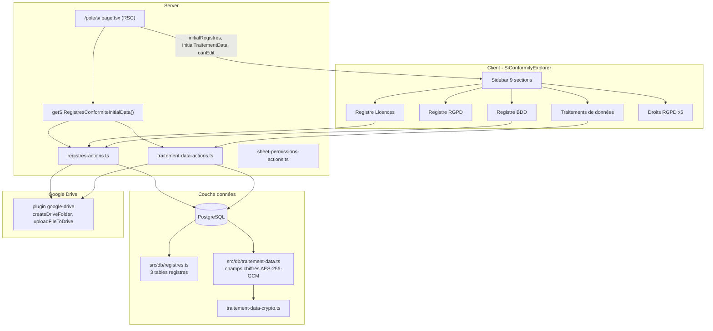

# Guide de réplication — Registres & Conformité S.I.

Document de référence pour porter la feature **Registres & Conformité (SI)** depuis Jaeger vers un **autre projet Next.js App Router**.

**Référence source :** `src/plugins/features/si-registres-conformite/` dans le dépôt Jaeger.

> **Ne pas confondre** avec `src/plugins/engine/plugin-registry.ts`, qui gère l'activation des plugins Jaeger, pas les registres métier SI.

---

## Table des matières

1. [Vue d'ensemble](#1-vue-densemble)
2. [Prérequis projet cible](#2-prérequis-projet-cible)
3. [Phase 1 — Schéma Drizzle et chiffrement](#3-phase-1--schéma-drizzle-et-chiffrement)
4. [Phase 2 — Server Actions](#4-phase-2--server-actions)
5. [Phase 3 — Explorateur et gestion CRUD commune](#5-phase-3--explorateur-et-gestion-crud-commune)
6. [Phase 4 — Vues registre S.I. et traitements de données](#6-phase-4--vues-registre-si-et-traitements-de-données)
7. [Phase 5 — Droits RGPD, Google Drive et intégration page SI](#7-phase-5--droits-rgpd-google-drive-et-intégration-page-si)
8. [Checklist de validation](#8-checklist-de-validation)
9. [Pièges connus](#9-pièges-connus)
10. [Inventaire des fichiers source Jaeger](#10-inventaire-des-fichiers-source-jaeger)

---

## 1. Vue d'ensemble

Le système couvre **4 registres métier** + **5 sections informatives Droits RGPD**, orchestrés par un explorateur à sidebar (`SiConformityExplorer`).



**Registres métier :**

| Registre | Table PostgreSQL | Spécificités |
|----------|------------------|--------------|
| Licences | `registres_licences` | Facturation, usage commercial, fichiers licence sur Drive |
| RGPD | `registres_rgpd` | Entrées par type de demande RGPD, dossier Drive |
| Bases de données | `registres_bdd` | Lien vers traitement de données + Google Sheet |
| Traitements de données | `traitement_data` | Fiches RGPD chiffrées, PDF, preuves consentement/mentions |

**Sections Droits RGPD** (5 placeholders informatifs) : accès, rectification, effacement, opposition, portabilité — guides/processus DSI, pas de workflow ticket.

**Choix d'architecture clés :**

| Choix | Détail |
|-------|--------|
| Stockage documentaire | **Google Drive** (dossiers créés à la création d'un registre/traitement) |
| API | **Server Actions** Next.js uniquement |
| Chiffrement | Champs sensibles `traitement_data` en AES-256-GCM (`TRAITEMENT_DATA_ENC_KEY`) |
| UI | Shell sidebar réutilisant les styles `database-explorer` |
| Accès | Réservé aux **DSI** + plugin `si-registres-conformite` actif |

---

## 2. Prérequis projet cible

| Dépendance | Usage |
|------------|-------|
| Next.js 14+ App Router | Pages, Server Components, Server Actions |
| PostgreSQL + Drizzle ORM | 4 tables métier |
| Better Auth (ou équivalent) | Session utilisateur dans toutes les server actions |
| Plugin **google-drive** | Création dossiers, upload, permissions Sheets |
| shadcn/ui | Dialog, Table, Tabs, Badge, AlertDialog, Card, Input, ScrollArea |
| lucide-react | Icônes sidebar et actions |
| Tailwind CSS | Styles (via `database-explorer.styles.ts`) |

**Variables d'environnement obligatoires** (déclarées dans `plugin.json`) :

```env
GOOGLE_CLIENT_ID=
GOOGLE_CLIENT_SECRET=
BETTER_AUTH_SECRET=
BETTER_AUTH_URL=
DRIVE_REGISTRES_FOLDER_URL=          # URL dossier racine Drive des registres
TRAITEMENT_DATA_ENC_KEY=             # 32 bytes en hex (64 caractères)
ID_DSI=                              # Pour permissions isDSI
```

```bash
npm install drizzle-orm postgres
npx shadcn@latest add button dialog table tabs badge alert-dialog card input scroll-area select
```

---

## 3. Phase 1 — Schéma Drizzle et chiffrement

### 3.1 Tables registres

Copier `src/db/registres.ts`.

**3 tables séparées** (historiquement une table unique `registres` avec enum, scindée en migration `0019`) :

```typescript
// Colonnes communes aux 3 tables
id: text (PK, UUID généré côté app)
userId: text → user.id (ON DELETE CASCADE)
anneeCivile: integer
nom: text
driveFolderUrl: text | null
createdAt, updatedAt: timestamp
```

**Spécificités par table :**

| Table | Champs additionnels |
|-------|---------------------|
| `registres_rgpd` | — |
| `registres_licences` | `dateFacturation`, `utilisationCommerciale`, `licenceCommercialeUrl` |
| `registres_bdd` | `traitementDataId` → `traitement_data.id` (SET NULL), `sheetExcelUrl` |

**Type unifié applicatif :**

```typescript
export type RegistreType = "rgpd" | "licences" | "bdd";

export type RegistreSelect =
  | (RegistreRgpdSelect & { type: "rgpd" })
  | (RegistreLicencesSelect & { type: "licences" })
  | (RegistreBddSelect & { type: "bdd" });
```

### 3.2 Table traitements de données

Copier `src/db/traitement-data.ts`.

| Champ | Chiffré ? |
|-------|-----------|
| `nomTraitement` | Oui |
| `reference` | Oui (auto-incrémentée "001", "002"…) |
| `descriptionFinalite` | Oui |
| `dateCreationFiche`, `dateMiseAJourFiche` | Non |
| `driveFolderUrl`, `fichePdfUrl` | Non |
| `preuveConsentementUrl`, `preuveMentionsUrl` | Non |

### 3.3 Chiffrement AES-256-GCM

Copier `si-conformity-explorer/lib/crypto/traitement-data-crypto.ts`.

```typescript
// Clé : TRAITEMENT_DATA_ENC_KEY = 32 bytes hex (64 chars)
export function encryptTraitementDataField(value: string): string | null;
export function decryptTraitementDataField(value: string): string | null;
export function decryptTraitementDataRow<T>(row: T): T | null;
```

Format stocké : `base64(iv[12] + authTag[16] + ciphertext)`.

Si la clé est absente en dev, les champs passent en clair (fallback).

### 3.4 Migrations Drizzle

Migrations historiques pertinentes :

| Migration | Contenu |
|-----------|---------|
| `0014_woozy_robbie_robertson.sql` | Création `traitement_data` |
| `0015_conscious_proudstar.sql` | `fiche_pdf_url` |
| `0016_sad_jack_murdock.sql` | Preuves consentement/mentions |
| `0019_free_bedlam.sql` | Split `registres` → 3 tables |
| `0020_sticky_centennial.sql` | FK `traitement_data_id` sur `registres_bdd` |

Ou snapshot consolidé : `drizzle/0042_burly_microchip.sql`.

Réexporter dans `src/db/schema.ts`.

---

## 4. Phase 2 — Server Actions

Créer `si-conformity-explorer/lib/` avec 3 fichiers principaux.

### 4.1 `registres-actions.ts`

| Action | Rôle |
|--------|------|
| `getAllRegistres()` | Union des 3 tables + join user + enrichissement nom traitement (BDD) |
| `getRegistreById(id)` | Recherche dans les 3 tables |
| `createRegistre(data)` | Insert + création dossier Drive |
| `updateRegistre(id, data)` | Mise à jour |
| `deleteRegistre(id)` | Suppression + nettoyage Drive |
| `searchRegistres(query, type?)` | Recherche texte |
| `uploadRegistreFile(id, file)` | Upload fichier dans dossier Drive |
| `uploadRegistreLicenceFiles(id, files)` | Upload fichiers licence commerciale |

**Pattern authentification :**

```typescript
"use server";
const authSession = await auth.api.getSession({ headers: await headers() });
if (!authSession?.user?.id) return null; // ou []
```

**Création dossier Drive (RGPD / Licences) :**

```typescript
const folderName = `Registre_${data.type}_${data.anneeCivile}_${data.nom}`;
const rootId = extractFolderIdFromUrl(process.env.DRIVE_REGISTRES_FOLDER_URL!);
const subfolderName = data.type === "licences" ? "licence" : "rgpd";
const subfolderId = await getOrCreateSubfolder(rootId, subfolderName);
const driveFolderUrl = await createDriveFolder(folderName, parentFolderUrl);
```

Les registres **BDD** ne créent pas de dossier Drive à la création (lien Sheet + traitement).

### 4.2 `traitement-data-actions.ts`

| Action | Rôle |
|--------|------|
| `getAllTraitementData()` | Liste avec déchiffrement |
| `getTraitementDataById(id)` | Détail |
| `createTraitementData(data)` | Chiffrement + dossier Drive + sous-dossiers preuves |
| `updateTraitementData(id, data)` | Re-chiffrement |
| `deleteTraitementData(id)` | Suppression |
| `getNextTraitementDataReference()` | Compteur "001", "002"… |
| `ensurePreuvesSubfolders(id)` | Crée `Preuves_RGPD/1_Consentement_personnes`, `2_Mentions_information` |
| `uploadTraitementPreuve(id, type, file)` | Upload preuve |
| `scanTraitementDrivePreuves(id)` | Scan fichiers Drive |
| `setTraitementPreuveLinks(id, urls)` | Liens externes Forms/Sheets |
| `uploadTraitementDataPdf(id, file)` | PDF fiche RGPD |

**Sous-dossiers preuves** (constantes dans `traitement-data-constants.ts`) :

```
{Dossier traitement}/
  └── Preuves_RGPD/
        ├── 1_Consentement_personnes/
        └── 2_Mentions_information/
```

Modèle fiche KiwiX : `TRAITEMENT_DATA_TEMPLATE_URL`.

### 4.3 `sheet-permissions-actions.ts`

Actions pour afficher « Qui a accès » à un Google Sheet (via Drive API permissions). Utilisé par `sheet-access-view.tsx`.

### 4.4 Types partagés

`registres-types.ts` :

```typescript
export type RegistreWithUser = RegistreSelect & {
  user: { id: string; name: string | null; email: string | null };
  traitementDataNom?: string | null; // enrichissement BDD
};

export type RegistreFormData = {
  type: RegistreType;
  anneeCivile: number;
  nom: string;
  // champs optionnels selon type…
};
```

---

## 5. Phase 3 — Explorateur et gestion CRUD commune

### 5.1 Structure de fichiers

```
src/features/si-registres-conformite/
├── plugin.json
├── index.ts
├── si-registres-conformite.tsx           # Wrapper client
├── si-registres-conformite-data.ts       # Chargement SSR + gating plugin
├── registres-management.tsx              # Table CRUD commune
├── registre-form-dialog.tsx              # Formulaire création/édition
├── sheet-access-view.tsx                 # Permissions Google Sheet
└── si-conformity-explorer/
    ├── si-conformity-explorer.tsx        # Explorateur principal
    ├── si-conformity-explorer.styles.ts  # 9 sections + styles shell
    └── lib/
        ├── registres-actions.ts
        ├── registres-types.ts
        ├── traitement-data-actions.ts
        ├── traitement-data-constants.ts
        ├── sheet-permissions-actions.ts
        └── crypto/traitement-data-crypto.ts
```

### 5.2 Chargement SSR initial

`si-registres-conformite-data.ts` :

```typescript
export async function getSiRegistresConformiteInitialData(input: { isDSI: boolean }) {
  if (!input.isDSI) {
    return { canAccessRegistresFeature: false, initialRegistres: [], initialTraitementData: [] };
  }

  const plugin = await getPluginRuntimeState("si-registres-conformite");
  const canAccess = Boolean(plugin?.enabled) && plugin?.status === "active";
  if (!canAccess) {
    return { canAccessRegistresFeature: false, initialRegistres: [], initialTraitementData: [] };
  }

  const [initialRegistres, initialTraitementData] = await Promise.all([
    getAllRegistres(),
    getAllTraitementData(),
  ]);

  return { canAccessRegistresFeature: true, initialRegistres, initialTraitementData };
}
```

### 5.3 `SiConformityExplorer` — sidebar 9 sections

Fichier : `si-conformity-explorer.tsx`

**2 groupes dans la sidebar :**

| Groupe | Sections |
|--------|----------|
| Registre S.I. | Licences, RGPD, Base de données, Traitement de données |
| Droits RGPD | Accès, Rectification, Effacement, Opposition, Portabilité |

**Persistance UI** (`localStorage`) :

```typescript
const STORAGE_KEYS = {
  selectorExpanded: "jaeger.si.conformityExplorer.sidebarExpanded",
  selectedSection: "jaeger.si.conformityExplorer.selectedSection",
};
```

**Rendu conditionnel par section :**

```typescript
switch (selectedSection) {
  case "registre-licences": return <RegistreLicencesView ... />;
  case "registre-rgpd":     return <RegistreRgpdView ... />;
  case "registre-bdd":      return <RegistreBddView ... />;
  case "registre-traitement-data": return <RegistreTraitementDataView ... />;
  case "droit-acces":       return <DroitAccesView isDSI={isDSI} />;
  // … autres droits RGPD
}
```

Styles : réutilise `databaseExplorerStyles` (shell grille, sidebar repliable 300px).

### 5.4 `RegistresManagement` — composant CRUD partagé

Utilisé par les vues RGPD, Licences et BDD avec `defaultFilterType`.

| Fonctionnalité | Détail |
|----------------|--------|
| Table | Colonnes adaptées au type (badges, dates, liens Drive) |
| Recherche | Appel `searchRegistres()` |
| Création/édition | `RegistreFormDialog` |
| Suppression | `AlertDialog` + `deleteRegistre()` |
| Accès Sheet | `SheetAccessView` pour registres BDD avec `sheetExcelUrl` |
| `canEdit` | Désactive boutons CRUD si false |

Pattern vue registre (ex. licences) :

```typescript
export function RegistreLicencesView({ initialRegistres, canEdit }) {
  return (
    <div className={databaseExplorerStyles.gridShell}>
      <RegistresManagement
        initialRegistres={initialRegistres}
        canEdit={canEdit}
        embedded
        defaultFilterType="licences"
      />
    </div>
  );
}
```

---

## 6. Phase 4 — Vues registre S.I. et traitements de données

### 6.1 Registres RGPD / Licences / BDD

| Fichier | Filtre | Spécificités formulaire |
|---------|--------|-------------------------|
| `registre-si/rgpd/registre-rgpd-view.tsx` | `rgpd` | Nom, année civile |
| `registre-si/licences/registre-licences-view.tsx` | `licences` | + date facturation, usage commercial, upload licence |
| `registre-si/bdd/registre-bdd-view.tsx` | `bdd` | + sélecteur traitement de données, URL Google Sheet |

### 6.2 Registre traitements de données

Fichiers dans `registre-si/traitement-data/` :

| Fichier | Rôle |
|---------|------|
| `traitement-data-view.tsx` | Table des fiches + actions |
| `traitement-data-form-dialog.tsx` | Création/édition (champs chiffrés côté serveur) |
| `traitement-preuves-dialog.tsx` | Gestion preuves consentement/mentions (upload + liens) |

**Workflow création traitement :**

1. Générer référence via `getNextTraitementDataReference()`
2. Chiffrer `nomTraitement`, `reference`, `descriptionFinalite`
3. Créer dossier Drive dédié
4. Créer sous-dossiers `Preuves_RGPD/…`
5. Insérer en base

### 6.3 `RegistreFormDialog`

Formulaire dynamique selon `RegistreType` :

- Champs communs : type, année civile, nom
- Licences : date facturation, utilisation commerciale (select), upload fichiers
- BDD : select traitement de données existant, URL Sheet Excel
- RGPD : champs minimaux

---

## 7. Phase 5 — Droits RGPD, Google Drive et intégration page SI

### 7.1 Sections Droits RGPD (placeholders)

Dossier `droits-rgpd/` :

```
droits-rgpd/
├── droits-rgpd-placeholder-view.tsx    # Composant générique (description + processus DSI)
├── droit-acces/index.tsx
├── droit-rectification/index.tsx
├── droit-effacement/index.tsx
├── droit-opposition/index.tsx
└── droit-portabilite/index.tsx
```

Chaque wrapper passe un titre et un contenu informatif. Si `isDSI=true`, affiche le processus opérationnel DSI.

Pas de persistance BDD — contenu statique / markdown inline.

### 7.2 Intégration Google Drive

**Dépendance obligatoire :** plugin `google-drive`

Fichier source : `src/plugins/core/google-workspace/services/drive/index.ts`

Fonctions utilisées :

| Fonction | Usage registres |
|----------|-----------------|
| `createDriveFolder(name, parentUrl?)` | Dossier registre RGPD/Licences, dossier traitement |
| `getOrCreateSubfolder(parentId, name)` | Sous-dossiers `licence/`, `rgpd/`, preuves |
| `uploadFileToDrive(folderUrl, file)` | Fichiers licence, PDF fiche, preuves |
| `listFilesInFolder(folderUrl)` | Scan preuves |
| `deleteDriveFile(fileId)` | Nettoyage à la suppression |
| `listDrivePermissions(fileId)` | Vue « Qui a accès » Sheet |

**Arborescence Drive typique :**

```
{DRIVE_REGISTRES_FOLDER_URL}/
├── licence/
│   └── Registre_licences_2025_MonLogiciel/
├── rgpd/
│   └── Registre_rgpd_2025_DemandeAcces/
└── (traitements — dossiers séparés à la racine ou sous-dossier dédié)
    └── Traitement_XXX/
        ├── fiche.pdf
        └── Preuves_RGPD/
              ├── 1_Consentement_personnes/
              └── 2_Mentions_information/
```

### 7.3 Intégration page SI

**Page SSR** — `src/app/(authenticated)/pole/si/page.tsx` :

```typescript
const { canAccessRegistresFeature, initialRegistres, initialTraitementData } =
  await getSiRegistresConformiteInitialData({ isDSI: permissions.isDSI });

const canAccessRegistresTab = permissions.isDSI && canAccessRegistresFeature;

// Redirection si ?tab=registres sans droits
if (rawSiTab === "registres" && !canAccessRegistresTab) {
  redirect("/pole/si?tab=pole");
}
```

**Onglets client** — `si-tabs.tsx` :

```typescript
const canAccessRegistres = isDSI && registresFeatureActive;
const canEditRegistres = isDSI && registresFeatureActive;

<TabsTrigger value="registres" disabled={!canAccessRegistres}>Registres</TabsTrigger>

<TabsContent value="registres">
  {canAccessRegistres ? (
    <SiRegistresConformite
      initialRegistres={initialRegistres}
      initialTraitementData={initialTraitementData}
      canEdit={canEditRegistres}
      isDSI={isDSI}
    />
  ) : (
    <p>{isDSI ? "Registres indisponibles (feature désactivée)" : "Accès réservé aux DSI"}</p>
  )}
</TabsContent>
```

**URL :** `/pole/si?tab=registres`

### 7.4 Permissions et gating

| Condition | Comportement |
|-----------|--------------|
| DSI + plugin actif | Onglet accessible, édition autorisée |
| Membre SI (non DSI) | Onglet visible mais **désactivé** (opacité 50 %) |
| Autres utilisateurs | Onglet désactivé |
| Plugin désactivé (même DSI) | Message « feature désactivée » |

**Labels accès** (`page-access-labels.ts`) :

```typescript
export const ACCESS_SI_REGISTRES_TAB = ["DSI"];
export const FOOTNOTE_SI_REGISTRES = "DSI, avec plugin si-registres-conformite activé";
```

**Navigation plugin** (`pole-plugin-tab-url.ts`) :

```typescript
// Mapping plugin → onglet SI
"si-registres-conformite" → "/pole/si?tab=registres"
```

### 7.5 Enregistrement plugin (optionnel hors Jaeger)

`plugin.json` :

```json
{
  "id": "si-registres-conformite",
  "name": "Registres & Conformité (SI)",
  "pole": "si",
  "requiresPlugins": ["google-drive"],
  "requiredEnv": [
    "GOOGLE_CLIENT_ID", "GOOGLE_CLIENT_SECRET",
    "BETTER_AUTH_SECRET", "BETTER_AUTH_URL",
    "DRIVE_REGISTRES_FOLDER_URL", "TRAITEMENT_DATA_ENC_KEY"
  ]
}
```

Sans système de plugins : intégrer directement l'onglet Registres avec un feature flag env.

### 7.6 Sécurité — point d'attention

Les server actions vérifient l'**authentification** (`auth.api.getSession`) mais **pas explicitement le rôle DSI** côté serveur. Le contrôle repose sur `canEdit` côté client et le gating SSR.

**Pour une réplication sécurisée**, ajouter un guard DSI dans chaque mutation :

```typescript
async function requireDSI() {
  const permissions = await getUserPermissions();
  if (!permissions.isDSI) throw new Error("Accès refusé : réservé aux DSI");
}
```

---

## 8. Checklist de validation

- [ ] Migration Drizzle : 3 tables registres + `traitement_data`
- [ ] Chiffrement/déchiffrement traitements avec `TRAITEMENT_DATA_ENC_KEY`
- [ ] Création registre RGPD → dossier Drive sous `rgpd/`
- [ ] Création registre Licences → dossier Drive sous `licence/`
- [ ] Création registre BDD → lien traitement + Sheet Excel
- [ ] CRUD traitements : référence auto, dossier Drive, sous-dossiers preuves
- [ ] Upload preuves consentement/mentions
- [ ] Sidebar 9 sections + persistance section active
- [ ] Recherche registres par type
- [ ] Vue « Qui a accès » sur Google Sheet (BDD)
- [ ] Onglet Registres : accessible DSI uniquement
- [ ] Plugin désactivé → message explicite
- [ ] Membre SI non-DSI → onglet grisé
- [ ] Sections Droits RGPD : contenu informatif affiché
- [ ] Suppression registre → nettoyage fichiers Drive

---

## 9. Pièges connus

| Sujet | Recommandation |
|-------|----------------|
| `TRAITEMENT_DATA_ENC_KEY` | Doit faire exactement 32 bytes (64 hex). Sinon crash au démarrage |
| Clé absente en dev | Champs stockés en clair — ne pas utiliser en production |
| `DRIVE_REGISTRES_FOLDER_URL` | Doit être une URL `/folders/{id}` valide |
| Plugin `google-drive` | Doit être actif avant `si-registres-conformite` |
| IDs registres | `text` UUID généré côté app (`crypto.randomUUID()`), pas `uuid()` PostgreSQL |
| Registre BDD sans traitement | `nom` utilisateur ; avec traitement → nom du traitement pour le dossier |
| Styles | Dépendance à `database-explorer.styles.ts` — porter ou remplacer le shell |
| `explorer-sidebar-storage.ts` | Utilitaire localStorage partagé — porter ou inline |
| Admin registres | `admin/tabs/database/registres/` existe en lecture seule mais n'est pas branché dans l'UI admin |
| Dates | Timestamps Drizzle peuvent arriver en string côté client |

---

## 10. Inventaire des fichiers source Jaeger

### A. Plugin feature (28 fichiers — copier tout le dossier)

```
src/plugins/features/si-registres-conformite/
├── plugin.json
├── index.ts
├── si-registres-conformite.tsx
├── si-registres-conformite-data.ts
├── registres-management.tsx
├── registre-form-dialog.tsx
├── sheet-access-view.tsx
└── si-conformity-explorer/
    ├── si-conformity-explorer.tsx
    ├── si-conformity-explorer.styles.ts
    ├── lib/
    │   ├── registres-actions.ts
    │   ├── registres-types.ts
    │   ├── traitement-data-actions.ts
    │   ├── traitement-data-constants.ts
    │   ├── sheet-permissions-actions.ts
    │   └── crypto/traitement-data-crypto.ts
    ├── registre-si/
    │   ├── rgpd/registre-rgpd-view.tsx
    │   ├── licences/registre-licences-view.tsx
    │   ├── bdd/registre-bdd-view.tsx
    │   ├── bdd/index.ts
    │   └── traitement-data/
    │       ├── traitement-data-view.tsx
    │       ├── traitement-data-form-dialog.tsx
    │       └── traitement-preuves-dialog.tsx
    └── droits-rgpd/
        ├── droits-rgpd-placeholder-view.tsx
        ├── droit-acces/index.tsx
        ├── droit-rectification/index.tsx
        ├── droit-effacement/index.tsx
        ├── droit-opposition/index.tsx
        └── droit-portabilite/index.tsx
```

### B. Schéma BDD

```
src/db/registres.ts
src/db/traitement-data.ts
src/db/schema.ts                    (réexport)
src/db/auth/auth-schema.ts          (table user)
```

### C. Intégration page SI

```
src/app/(authenticated)/pole/si/page.tsx
src/app/(authenticated)/pole/si/si-tabs.tsx
```

### D. Moteur plugin + navigation

```
src/plugins/engine/plugin-registry.ts
src/plugins/engine/plugin-types.ts
src/lib/pole-plugin-tab-url.ts
src/lib/page-access-labels.ts
src/lib/permissions.ts
src/plugins/navbar-myster/nav-myster-categories.ts
```

### E. Dépendances transverses obligatoires

```
src/plugins/core/google-workspace/services/drive/index.ts
src/plugins/core/google-workspace/services/drive/plugin.json
src/plugins/engine/explorer-sidebar-storage.ts
src/plugins/features/database-explorer/database-explorer.styles.ts
src/lib/auth.ts
src/lib/db.ts
```

### F. Documentation complémentaire

```
docs/RGPD-chiffrement-donnees.md    (contexte chiffrement global)
```

### G. Admin (optionnel — non branché)

```
src/app/(authenticated)/admin/tabs/database/registres/registres-actions.ts
src/app/(authenticated)/admin/tabs/database/registres/registres-table.tsx
```

### Ordre de portage recommandé

1. Schéma Drizzle + migrations + crypto
2. Plugin google-drive (ou adapter vos appels Drive)
3. Server actions (`registres-actions`, `traitement-data-actions`, `sheet-permissions`)
4. Composants CRUD (`registres-management`, `registre-form-dialog`, `sheet-access-view`)
5. Explorateur (`si-conformity-explorer` + styles + 4 vues registre)
6. Traitements de données (view + 2 dialogs)
7. Droits RGPD placeholders
8. Chargement SSR (`si-registres-conformite-data`) + wrapper
9. Intégration page SI (`page.tsx`, `si-tabs.tsx`)
10. Enregistrement plugin + navigation

**Estimation effort :** ~35 fichiers (28 plugin + 7 intégration/dépendances). Complexité concentrée dans `registres-actions.ts` (~740 lignes) et `traitement-data-actions.ts` (~700 lignes).

---

*Généré à partir de l'implémentation Jaeger — juin 2026.*
